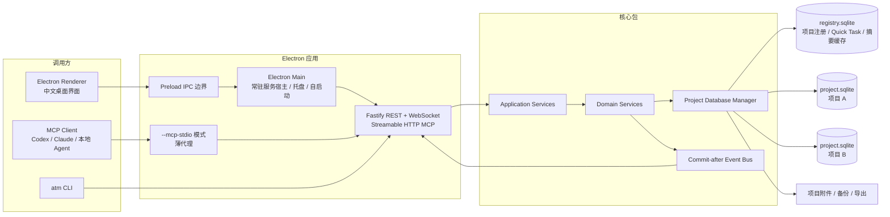

# AyanamiTaskManager（绫波任务管理器）完整开发设计文档

> 文档版本：1.0  
> 目标平台：Windows 10 / Windows 11 x64  
> 产品英文名：AyanamiTaskManager  
> 产品中文名：绫波任务管理器  
> 命令行短名：`atm`  
> 预期开发目录：`R:\Project_All\AyanamiTaskManager`  
> 参考代码库：`R:\Project_All\ayanamiAgent Hub`（本地仓库为最终依据）

---

## 0. 给开发 Agent 的强制执行指令

本任务要求交付可长期使用的完整成品。分阶段仅代表施工顺序，所有阶段均为必做项，不得把中间可运行状态当作最终交付。

1. 开始编码前，完整审计 `R:\Project_All\ayanamiAgent Hub`。重点阅读协议层、SQLite 初始化与迁移、事务封装、任务状态机、进度计算、项目身份、WebSocket 事件重放、CLI、Dashboard、发布脚本和测试。GitHub 主分支只能作为补充参考，本地仓库中的未推送代码优先。
2. 在新目录 `R:\Project_All\AyanamiTaskManager` 建立独立仓库。不得把本产品硬塞进 CrossAgent Hub，也不得让 TaskManager 在运行时依赖 Hub。两者职责明确分开：TaskManager 负责计划、进度与项目记录；Hub 继续负责通信、写入冲突和代码评审。
3. 从第一天就采用最终架构：桌面应用、全局注册库、每项目独立 SQLite、MCP/CLI、实时事件流、系统自启动。禁止先做浏览器网页、单库、JSON 文件或 Markdown 任务账本，再承诺后续迁移。
4. 不允许使用 `agenttask.md`、`localStorage`、内存对象或临时 JSON 作为产品事实源。项目任务数据只能写入对应项目数据库；简单临时任务写入全局注册库中的 Quick Task 表。
5. UI 全部使用中文。内部枚举、API 字段和数据库列使用稳定英文标识，通过映射显示中文，界面不得直接暴露 `IN_PROGRESS`、`BLOCKED` 等英文枚举。
6. 不实现内部 LLM。系统只保存 Agent 主动提交的计划、摘要、状态、证据和决策，不保存隐藏推理，不自动把长对话塞进数据库。
7. 所有写操作经过应用服务和领域规则。Agent、CLI、桌面渲染进程均不得直接写 SQLite。
8. 开发中优先复用 Hub 已验证的代码和现有依赖。直接复制代码时记录来源；无法直接复用时复用设计和测试模式。新增依赖前先证明现有依赖不能解决。
9. 每个阶段运行针对性测试；完成领域、存储、传输或发布阶段时运行对应完整测试；最终交付前运行全量单元、集成、并发、迁移、E2E 和打包烟测。不要为一次纯样式调整反复跑所有底层并发测试。
10. 不得以 TODO、占位页面、假按钮、静态假数据、未连通的接口或“后续补充”宣称完成。遇到非外部硬阻塞时自行按本文决策继续实现，不反复向用户确认已明确的架构选择。
11. 一旦 TaskManager 的核心存储、MCP 和任务页面可用，立即把本项目自身导入 TaskManager，使用它继续管理余下开发，完成一次完整自举验收。
12. 最终必须交付：源码、Windows 安装包、便携包、系统自启动、托盘运行、MCP 接入、CLI、中文 UI、数据库迁移、备份恢复、完整测试报告、用户说明和架构文档。

---

## 1. 最终结论

AyanamiTaskManager 建成一个**本地优先、中文界面、Agent 原生、桌面常驻**的项目进度控制台，采用以下固定架构：

- 一个全局 `registry.sqlite`：只保存项目注册信息、跨项目摘要缓存、全局搜索投影、应用设置和简单临时任务。
- 每个正式项目一个独立 `project.sqlite`：保存该项目的目标、里程碑、任务树、依赖、进度更新、阻塞、决策、证据、Agent 会话和事件流。
- 一个常驻本地服务：生产环境由 Electron Main 进程承载，绑定回环地址；桌面 UI、MCP、CLI 均调用同一套应用服务。
- 一个桌面应用：Windows 登录后自动启动并最小化到托盘，实时展示所有项目进度、阻塞和 Agent 活动。
- 一套通用 Agent 接口：不绑定 Codex、Claude 或某个本地模型。任何支持 MCP、CLI 或本地 HTTP 的 Agent 都能注册会话、读取上下文、创建计划、认领任务、写进度和完成交接。
- 一条只追加事件流：当前状态保存在普通表中，事件用于审计、增量读取、实时推送和崩溃恢复。无需采用纯事件溯源，也不维护第二套真相。
- 一个 Quick Task 通道：简单、一次性、无需连续跟踪的工作不创建项目数据库；需要升级时可原子化晋升为正式项目或挂入已有项目。

这套架构直接解决当前 `agenttask.md` 的四个根本问题：多人/多线程并发写冲突、每次读取浪费上下文、状态不可计算、历史与当前计划混在一起。

---

## 2. 产品目标、边界与非目标

### 2.1 核心目标

1. 用户打开应用即可看到全部项目的真实进度、当前里程碑、活跃任务、阻塞项、等待用户事项和活跃 Agent。
2. 单 Agent 可以把它当作长期项目记忆和进度账本；主 Agent 加多个 Subagent 可以共享计划、分配任务、认领工作、交接和恢复中断。
3. Agent 每次只读取与当前任务相关的紧凑摘要，支持按项目序列号增量拉取变化，避免反复加载完整 Markdown。
4. 任务进度必须可解释：展示来自检查项计算、子任务汇总或 Agent 主动报告的来源，不生成虚假的精确百分比。
5. 项目数据可独立备份、归档、迁移和恢复。任一项目数据库损坏或迁移失败，不影响其他项目打开。
6. 人工操作和 Agent 操作走同一领域服务，保证状态机、版本冲突、依赖和完成门槛一致。
7. 应用默认中文，视觉风格参考用户提供的 P2：暖白背景、紫色主色、轻边框、大圆角卡片、克制阴影、清晰留白。

### 2.2 明确非目标

以下内容有意排除，不视为缺失功能：

- 云同步、远程访问、手机端和多用户协作服务器。
- 企业级账户、组织、RBAC、LDAP、SSO、审计防篡改和数据库加密。
- 通用聊天、离线消息投递、可信用户指令证明、终端控制、代码评审工作树；这些继续由 CrossAgent Hub 负责。
- 任意自定义工作流设计器、任意自定义字段引擎和 Jira 级别的企业配置中心。
- 在 TaskManager 内调用 LLM 自动总结、拆任务或判断进度。Agent 自己完成智能判断，TaskManager 保持确定性。
- 任意命令执行、任意 SQL 控制台或让前端直接访问文件系统。
- 互联网自动更新。应用通过新安装包升级，用户数据通过迁移保留。

---

## 3. 从成熟产品与现有工作表中抽取的设计模式

### 3.1 成熟产品模式

| 来源 | 已验证的模式 | AyanamiTaskManager 的落地方式 |
|---|---|---|
| Linear | 项目状态、项目健康度、结构化项目更新、更新过期提醒、进度历史 | 项目生命周期与健康度分开；项目更新包含“本期完成、问题、下一步、健康度”；超过更新周期显示“缺少更新” |
| GitHub Issues / Projects | 父子任务、父项进度、阻塞关系、表格/看板/路线图多视图、保存筛选 | 任务树最多 8 层；父项按权重汇总；支持阻塞/关联/重复；同一数据提供看板、列表、层级和时间线视图 |
| Jira | 目标—大型事项—任务—子任务层级、子任务完成门槛、明确状态机 | 采用目标、里程碑、工作项三级主结构；父任务完成前校验必做子项和验收项；状态迁移集中校验 |
| 现有 CrossAgent Hub | 稳定项目身份、SQLite WAL、版本号、幂等写、领取租约、任务依赖、事务内事件、提交后推送、断线增量重放 | 直接复用或改写对应模块，保留其确定性和恢复能力，移除消息投递、可信指令、重型评审与模型专用适配 |

### 3.2 从 P1 项目进度表抽取的有效字段

P1 的价值在于它覆盖了完整管理视角，以下信息必须保留：

| P1 信息 | 产品字段/模块 |
|---|---|
| 项目名称、项目编码 | `projects.name`、`projects.code` |
| 总体目标与阶段目标 | `objectives`、`milestones` |
| 分层编号和子项 | `work_items.parent_id`、项目内短编号 |
| 计划开始、计划结束 | `planned_start_date`、`target_date` |
| 实际开始、实际完成 | `started_at`、`completed_at` |
| 负责人 | `assignee_agent_id`、当前领取会话 |
| 进度百分比 | `computed_progress`、`reported_progress`、`progress_source` |
| 正常、延误、受阻等状态 | 工作项状态、项目健康度、系统关注信号 |
| 备注、阶段说明 | `progress_updates`、`records` |
| 问题与待协调事项 | `blockers`、`waiting_for` |
| 验收材料和完成依据 | `checklist_items`、`artifacts`、证据引用 |

P1 的表格密度不应直接复制。默认页面采用卡片、看板和详情抽屉；需要批量核对时提供高密度列表视图。所有表格使用统一底色和细分隔线，不做白蓝相间斑马纹。

### 3.3 从 P2 视觉参考抽取的规则

- 暖灰白页面背景，白偏暖的内容卡片，紫色作为唯一主强调色。
- 16px 左右大圆角，1px 低对比边框，阴影只用于层级，不使用厚重悬浮效果。
- 重要操作按钮位于页面右侧或卡片右下，主按钮保持单一。
- 创建项目采用三步向导：选择目录与识别项目 → 配置项目 → 接入 Agent。
- 信息密度中等。超宽屏充分利用横向空间，避免 P2 中大面积无意义空白。
- 页面底部可以保留三张能力说明卡，但主工作页优先展示真实项目数据。

---

## 4. 对 ayanamiAgent-Hub 的复用策略

### 4.1 必须优先复用或改写的模块

| Hub 中的实现 | TaskManager 用法 |
|---|---|
| `packages/protocol` 的 Zod 枚举、状态机和进度辅助函数 | 建立 `@ayanami-task/protocol`，保留单一协议源、运行时校验和类型推导 |
| `apps/hub/src/db/database.ts` | 复用 SQLite 打开、PRAGMA 配置和数据库生命周期模式，改成 Registry/Project 两类数据库 |
| `apps/hub/src/db/migration-runner.ts` | 复用迁移顺序、文件哈希、历史缺口校验和迁移前备份 |
| `apps/hub/src/services/store/context.ts` | 复用“领域状态 + 事件 + 幂等响应同事务写入，提交后才推送”的模式 |
| 任务服务中的依赖、版本、领取、拆分、进度和完成门槛 | 抽成通用 WorkItem 聚合，去除强制代码评审假设 |
| `.crossagent/project.json` 稳定项目身份和路径别名 | 改成 `.ayanami-task/project.json`，支持目录移动、Git worktree 和同项目多路径 |
| 项目序列号、WebSocket gap replay | 用于 MCP/CLI/UI 的 `since_seq` 增量读取和断线恢复 |
| React/Vite、TanStack Query、Zustand、Phosphor、Playwright | 作为桌面渲染层的首选技术栈，优先复用已有 UI primitive 和测试模式 |
| Windows 便携包、原生模块 ABI 校验和发布烟测 | 改造成 Electron Forge 打包后的安装包/便携包验证流程 |

### 4.2 明确不带入的模块

- Codex Bridge、Claude Channel、Hook 投递和模型版本探测。
- 普通消息线程、收件箱、投递 ACK 状态机和可信用户指令证明。
- 写入意图和文件冲突检测。TaskManager 可以显示外部引用，但不重复实现 Hub 的冲突控制。
- 不可变 review bundle、隔离 worktree、finding 和终端 PTY。
- 复杂凭证轮换、项目级会话票据和企业安全配置。

### 4.3 许可证处理

当前 Hub 仓库声明为 `AGPL-3.0-only`。开发 Agent 必须在 `docs/reuse-map.md` 中记录每个直接复制文件的来源和修改；复制代码时保留版权与许可证信息。若新产品将来采用不同许可证，由仓库作者统一决定，开发 Agent 不得自行删改原许可证声明。

---

## 5. 总体架构



### 5.1 进程与运行模式

服务逻辑独立成包，但生产环境由 Electron Main 进程直接承载。这是最终部署方式，避免额外捆绑 Node 运行时以及 `better-sqlite3` 的 ABI 双重管理。

应用可执行文件必须支持以下模式：

| 模式 | 启动参数 | 行为 |
|---|---|---|
| 正常桌面 | 无参数 | 启动/连接常驻服务并打开主窗口 |
| 后台常驻 | `--background` | 启动服务和托盘，不显示窗口；系统登录时使用 |
| MCP stdio | `--mcp-stdio` | 不打开窗口，不持有数据库写连接；连接常驻服务并把 stdio MCP 转发到同一应用服务 |
| CLI | `--cli ...` | 执行一次命令，以文本或 JSON 输出后退出 |
| 健康检查 | `--doctor` | 检查服务、SQLite、项目库、迁移、备份、自启动和 MCP |

应用只允许一个后台服务实例。GUI 可以重复唤醒已有实例；多个 `--mcp-stdio` 代理可以并行存在。

### 5.2 分层约束

- `domain` 不得导入 Electron、Fastify、MCP、React 或具体 Agent 类型。
- `application` 编排用例、权限边界、事务和 DTO，不直接写 SQL。
- `storage-sqlite` 负责迁移、Repository、行映射和数据库连接池。
- `transport-*` 只做协议解析、调用应用服务和错误映射。
- `desktop` 只负责生命周期、托盘、自启动、窗口和 IPC。
- `renderer` 不允许 Node Integration，通过 Preload 暴露的窄接口或本地 API 调用服务。

---

## 6. 仓库结构

```text
AyanamiTaskManager/
├─ apps/
│  ├─ desktop/
│  │  ├─ src/main/                 # Electron Main、托盘、自启动、窗口
│  │  ├─ src/preload/              # 窄 IPC API
│  │  └─ src/renderer/             # React 中文界面
│  └─ daemon/                      # Fastify/WebSocket/MCP 服务入口，可独立测试
├─ packages/
│  ├─ protocol/                    # Zod schema、枚举、DTO、状态迁移、中文标签映射键
│  ├─ domain/                      # Project、WorkItem、Progress、Blocker、Record、Agent
│  ├─ application/                 # 用例、事务边界、查询投影、上下文包
│  ├─ storage-sqlite/              # Registry/Project DB、迁移、Repository、备份
│  ├─ client/                      # REST/WebSocket TypeScript Client
│  ├─ mcp/                         # Streamable HTTP 与 stdio 适配
│  ├─ cli/                         # atm 命令实现
│  ├─ ui/                          # 可复用 UI primitive、中文文案、设计 token
│  └─ testing/                     # Fixture、临时数据库、并发和 E2E 工具
├─ migrations/
│  ├─ registry/
│  └─ project/
├─ docs/
│  ├─ adr/
│  ├─ architecture.md
│  ├─ data-model.md
│  ├─ agent-integration.md
│  ├─ user-guide.md
│  ├─ troubleshooting.md
│  ├─ reuse-map.md
│  └─ release-checklist.md
├─ scripts/
├─ fixtures/
├─ forge.config.ts
├─ pnpm-workspace.yaml
└─ package.json
```

### 6.1 技术栈

以 Hub 已使用并验证的 TypeScript 栈为基线：

- 桌面：Electron + Electron Forge。
- 前端：React、Vite、TanStack Query、Zustand、Phosphor Icons。
- 本地服务：Fastify、WebSocket、Zod。
- 数据库：SQLite + `better-sqlite3`，直接 SQL 和显式迁移，不引入 ORM。
- Agent 协议：官方 `@modelcontextprotocol/sdk`，同时支持 Streamable HTTP 和 stdio。
- 测试：Vitest、Playwright；并发、崩溃与迁移测试使用临时真实数据库。
- 包管理：pnpm workspace，所有版本锁定在 lockfile 中。

新增依赖必须写入 `docs/adr/ADR-DEPENDENCY-<name>.md` 或合并到对应 ADR，说明现有依赖无法满足的具体原因。小型工具函数优先自行实现；成熟且复杂的 UI/协议能力优先用维护良好的库。

---

## 7. 存储、项目身份与数据库分配

### 7.1 默认数据目录

```text
%LOCALAPPDATA%\AyanamiTaskManager\
├─ registry\
│  └─ registry.sqlite
├─ projects\
│  └─ <project_ulid>\
│     ├─ project.sqlite
│     ├─ artifacts\
│     ├─ backups\
│     └─ manifest.json
├─ backups\
│  └─ registry\
├─ exports\
├─ runtime\
│  ├─ daemon.json                  # pid、端口、版本、启动时间
│  ├─ local-token                 # 轻量本地令牌
│  └─ daemon.lock
├─ logs\
└─ trash\
```

项目代码用于人类识别，ULID 用作稳定内部 ID 和目录名。数据库不放入项目源码目录，避免误提交、Git 操作、同步盘和 worktree 造成锁与复制问题。

### 7.2 项目标识

- `project_id`：不可变 ULID，系统内部主键。
- `project_code`：不可变、人类可读、全局唯一；推荐 2–12 位大写字母、数字和短横线，必须以字母开头。
- 自动生成优先从项目名称提取简短代码，例如 `AyanamiAgent-Hub → AHUB`；冲突时追加数字。无法可靠提取时使用 `AYT-0001`。
- 项目名称、描述、路径可修改；项目代码创建后不直接修改，避免任务引用失效。
- 工作项显示键：`AHUB-T-0012`；里程碑：`AHUB-M-003`；决策：`AHUB-D-005`；阻塞：`AHUB-B-002`。

### 7.3 项目目录标记

正式项目根目录写入：

```json
{
  "schema_version": 1,
  "project_id": "01K...",
  "project_code": "AHUB",
  "name": "Ayanami Agent Hub"
}
```

文件位置：`.ayanami-task/project.json`。该文件只保存身份，不保存任务数据和密钥。

默认把 `.ayanami-task/` 写入仓库本地 `.git/info/exclude`，不擅自修改团队 `.gitignore`。Git worktree 通过 `git common-dir`、标记文件和 `project_paths` 共同识别为同一项目。

### 7.4 全局注册库与项目库的职责

`registry.sqlite` 可以保存：

- 项目 ID、代码、名称、数据库路径、项目路径别名和生命周期。
- 可重建的跨项目摘要缓存与全局搜索投影。
- Quick Task 及其简短更新。
- 应用设置、窗口状态、备份目录、全局事件序列。

`registry.sqlite` 不得保存正式项目的完整任务、检查项、决策正文、完整进度记录或附件事实源。正式项目的权威数据只存在对应 `project.sqlite` 中。

### 7.5 禁止跨项目 ATTACH 写事务

不要通过 `ATTACH DATABASE` 同时修改注册库和项目库。WAL 模式下，多数据库事务只能保证每个文件内部原子，无法保证断电时多个文件整体一致。

采用以下模式：

1. 项目变更在 `project.sqlite` 中写入领域状态、事件和 outbox，同一事务提交。
2. 提交后 dispatcher 更新 `registry.sqlite` 的摘要缓存与全局搜索投影。
3. 成功后标记 outbox 已投递。
4. 服务启动时比较项目 `current_sequence` 与注册库缓存序列，自动补齐未投递或过期摘要。
5. 注册库摘要始终被视为缓存，可从项目库重建。

### 7.6 项目创建的崩溃安全流程

创建项目使用明确的 `CREATING → ACTIVE` saga：

1. 规范化项目路径，检查标记、路径别名和 Git common-dir，防止重复创建。
2. 在注册库中分配 ULID 和项目代码，写入 `CREATING` 状态。
3. 在临时目录创建项目数据库，应用全部迁移，写入 `project_meta`，运行 `PRAGMA quick_check`。
4. 原子重命名临时目录为最终项目目录。
5. 写项目标记并注册路径。
6. 把注册记录改为 `ACTIVE`，写全局事件。
7. 任一步骤失败，清理临时目录；启动恢复程序处理残留 `CREATING` 项目。项目代码允许留下空号，不回收编号。

### 7.7 简单任务与正式项目的判定

#### 固定原则

- 当前工作目录已经匹配正式项目时，直接使用该项目数据库，不再新建数据库。
- 没有匹配项目且工作只是一次性短任务时，创建 Quick Task，存入注册库。
- 没有匹配项目且需要持续管理时，创建正式项目数据库。
- 用户或 Agent 可以显式指定 `quick` 或 `project`；显式指定优先于自动判断。

#### 自动评分

| 信号 | 分值 |
|---|---:|
| 需要多个 Agent 或 Subagent | +3 |
| 预计跨多个会话继续 | +2 |
| 独立可验收子任务不少于 4 个 | +2 |
| 存在前置依赖、交接或并行分工 | +2 |
| 预计耗时不少于 45 分钟 | +1 |
| 需要验收证据、评审或长期决策记录 | +1 |
| 有目标日期或里程碑 | +1 |

无已有项目时，得分达到 3 创建正式项目；低于 3 创建 Quick Task。以下工作直接视为 Quick：一次问答、单条命令、无后续的一次性修复、预计 15 分钟以内且没有依赖。

Agent 自动创建正式项目时必须提交简短 `creation_reason` 和上述 signals，系统记录到创建事件中；不需要人工确认，但必须做路径和重复项目检查。

### 7.8 Quick Task 晋升

Quick Task 只包含标题、简短说明、状态、到期日、创建者、最近更新和完成摘要，不支持任务树、依赖或多 Agent 领取。

当 Quick Task 变复杂时，支持两种晋升：

1. 挂入已有项目：创建正式工作项，复制更新历史，Quick Task 标记为 `PROMOTED` 并保留目标引用。
2. 创建新项目：执行项目创建 saga，把 Quick Task 变成根任务，保留原 Quick ID 作为来源。

晋升成功前不得删除 Quick Task；崩溃恢复后可安全重试。

---

## 8. 数据模型

### 8.1 Registry 数据库核心表

| 表 | 用途 | 关键字段 |
|---|---|---|
| `schema_migrations` | 注册库迁移历史与文件哈希 | `version, name, content_sha256, hash_origin, applied_at` |
| `app_meta` | 全局序列和应用数据版本 | `current_sequence, created_at, updated_at` |
| `projects` | 项目注册主表 | `id, code, name, description, db_path, lifecycle, coordination_mode, created_at, archived_at` |
| `project_paths` | 一个项目的多个路径/worktree | `project_id, canonical_path, git_common_dir, is_primary, last_seen_at` |
| `project_summary_cache` | 可重建跨项目摘要 | `project_id, project_sequence, progress, health, counts, current_milestone, last_activity_at` |
| `global_search_documents` | 跨项目搜索投影 | `project_id, entity_type, entity_key, title, summary, project_sequence` |
| `quick_tasks` | 不创建项目库的简单任务 | `id, local_no, title, note, status, due_date, source_cwd, actor, version` |
| `quick_task_updates` | Quick Task 简短进度 | `quick_task_id, summary, percent, actor, created_at` |
| `saved_views` | UI 保存筛选 | `scope, name, query_json, sort_json` |
| `backup_catalog` | 已知备份及完整性信息 | `scope, project_id, path, sha256, size_bytes, created_at, verified_at` |
| `global_events` | 全局实时事件 | `sequence, type, aggregate_id, payload_json, created_at` |
| `settings` | 应用级设置 | `key, value_json, version, updated_at` |

全局搜索使用 `global_search_documents_fts`，只索引项目代码、工作项标题和短摘要，不复制完整正文。

### 8.2 每项目数据库核心表

| 表 | 用途 | 关键字段 |
|---|---|---|
| `schema_migrations` | 项目库迁移历史 | 同 Registry |
| `project_meta` | 项目自身身份和当前序列 | `project_id, project_code, name, current_sequence, schema_version` |
| `counters` | 项目内短编号分配 | `name, next_value` |
| `objectives` | 项目目标 | `id, local_no, title, description, definition_of_done_json, status, weight` |
| `milestones` | 阶段与目标日期 | `id, local_no, objective_id, title, target_date, status, weight, sort_key` |
| `work_items` | Epic/任务/子任务/缺陷/研究/评审 | 见 8.3 |
| `work_item_relations` | 阻塞、关联、重复关系 | `source_id, target_id, relation_type` |
| `checklist_items` | 可计算进度与验收门槛 | `work_item_id, title, kind, status, weight, evidence_required, evidence_json` |
| `labels` / `work_item_labels` | 轻量分类 | 名称、颜色、关联 |
| `progress_updates` | 工作项进度记录 | `work_item_id, percent, summary, completed_json, next_json, blocker_text, actor` |
| `project_updates` | 项目级结构化周报/阶段更新 | `health, summary, completed_json, risks_json, next_json, from_sequence, to_sequence` |
| `blockers` | 结构化阻塞 | `local_no, work_item_id, severity, title, detail, waiting_for, status, resolved_at` |
| `records` | 决策、约束、事实、风险、参考、经验 | `kind, title, summary, detail, importance, status, supersedes_id, scope` |
| `artifacts` | 证据和附件引用 | `kind, name, local_path, sha256, size_bytes, metadata_json` |
| `agents` | 持久逻辑 Agent | `id, display_name, client_kind, capabilities_json` |
| `agent_sessions` | 一次具体运行/线程 | `id, agent_id, parent_session_id, thread_id, cwd, git_branch, git_head, work_state, connection_state` |
| `handoffs` | 任务级交接 | `work_item_id, from_session_id, to_agent_id, summary, next_action, acknowledged_at` |
| `events` | 项目只追加事件流 | `sequence, type, actor, aggregate, causation_id, correlation_id, payload_json` |
| `idempotency_keys` | Agent/CLI 重试去重 | `key, operation, request_fingerprint, response_json, expires_at` |
| `outbox` | 注册库摘要/搜索投影同步 | `id, project_sequence, type, payload_json, delivered_at` |
| `settings` | 项目级设置 | `key, value_json, version` |
| `search_documents` + FTS5 | 中文全文检索 | 实体类型、标题、正文、更新时间 |

### 8.3 `work_items` 关键字段

```text
id                      TEXT PRIMARY KEY        # ULID
local_no                INTEGER UNIQUE NOT NULL # 项目内编号
parent_id               TEXT NULL               # 自引用，最多 8 层
objective_id            TEXT NOT NULL
milestone_id            TEXT NULL
type                    TEXT NOT NULL            # EPIC/TASK/SUBTASK/BUG/RESEARCH/REVIEW
title                   TEXT NOT NULL
description             TEXT NOT NULL DEFAULT ''
acceptance_json         TEXT NOT NULL DEFAULT '[]'
status                  TEXT NOT NULL
priority                TEXT NOT NULL
sort_key                INTEGER NOT NULL
planned_start_date      TEXT NULL                # YYYY-MM-DD
target_date             TEXT NULL
started_at              TEXT NULL
completed_at            TEXT NULL
assignee_agent_id       TEXT NULL
claimed_by_session_id   TEXT NULL
claim_lease_until       TEXT NULL
reported_progress       REAL NULL
computed_progress       REAL NOT NULL DEFAULT 0
progress_source         TEXT NOT NULL            # CHECKLIST/CHILDREN/REPORTED/NONE
weight                  REAL NOT NULL DEFAULT 1
blocked_reason          TEXT NULL
waiting_for             TEXT NULL
verification_required   INTEGER NOT NULL DEFAULT 0
version                 INTEGER NOT NULL DEFAULT 0
created_by_agent_id     TEXT NULL
created_by_session_id   TEXT NULL
created_at              TEXT NOT NULL
updated_at              TEXT NOT NULL
archived_at             TEXT NULL
```

### 8.4 任务状态与中文映射

| 内部状态 | 中文显示 | 说明 |
|---|---|---|
| `BACKLOG` | 待整理 | 已记录但尚未准备执行 |
| `READY` | 可开始 | 前置依赖满足，可领取 |
| `CLAIMED` | 已认领 | 某会话获得执行租约，尚未开始实质工作 |
| `IN_PROGRESS` | 进行中 | 正在执行 |
| `BLOCKED` | 受阻 | 有明确阻塞，必须记录原因 |
| `WAITING_AGENT` | 等待其他 Agent | 等待子任务、交接或其他 Agent 结果 |
| `WAITING_USER` | 等待用户 | 需要用户输入、选择或外部凭据 |
| `VERIFYING` | 待验收 | 实现已完成，等待检查项/人工/Agent 验收 |
| `DONE` | 已完成 | 完成门槛全部满足 |
| `CANCELLED` | 已取消 | 不再纳入进度分母 |

核心迁移规则：

```text
BACKLOG       -> READY | CANCELLED
READY         -> CLAIMED | IN_PROGRESS | CANCELLED
CLAIMED       -> IN_PROGRESS | READY | CANCELLED
IN_PROGRESS   -> BLOCKED | WAITING_AGENT | WAITING_USER | VERIFYING | DONE | CANCELLED
BLOCKED       -> IN_PROGRESS | READY | CANCELLED
WAITING_*     -> IN_PROGRESS | VERIFYING | CANCELLED
VERIFYING     -> DONE | IN_PROGRESS | CANCELLED
DONE          -> IN_PROGRESS            # 明确“重新打开”操作
CANCELLED     -> BACKLOG                 # 明确“恢复”操作
```

状态变更必须经过领域函数。`BLOCKED` 必须有活动 blocker 或 `blocked_reason`；`WAITING_USER` 必须有 `waiting_for`；`DONE` 必须通过完成门槛。

### 8.5 完成门槛

工作项进入 `DONE` 前执行：

1. 所有 `evidence_required=1` 的检查项均为 `DONE` 且有证据。
2. 所有标记为必做的子任务均为 `DONE` 或有明确豁免记录。
3. 不存在活动的 blocking blocker。
4. `verification_required=1` 时，必须先经过 `VERIFYING`，并有验收记录。
5. 若存在未完成的阻塞依赖，拒绝完成并返回具体依赖。

Solo 项目默认 `verification_required=0`；Multi 项目默认由任务创建者或项目设置决定，不强制所有小任务走重型评审。

### 8.6 进度计算

进度保存三个概念：

- `reported_progress`：Agent 或用户主动报告，允许为空。
- `computed_progress`：系统根据检查项或子任务计算。
- `progress_source`：明确显示使用哪种来源。

算法：

1. `DONE = 100`；`CANCELLED` 从父级分母排除。
2. 有子任务时，按活动子任务 `weight` 加权汇总，来源为 `CHILDREN`。
3. 无子任务但有检查项时，按检查项 `weight` 计算已完成比例，来源为 `CHECKLIST`。
4. 没有可计算结构且存在主动报告时，采用 `reported_progress`，来源为 `REPORTED`。
5. 其他情况为 0，来源为 `NONE`。
6. 非 `DONE` 状态的有效进度最高显示 99，防止“100% 但未完成”。
7. 任一子项、检查项或权重变化，在同一事务内向上重算祖先、里程碑和项目摘要。
8. UI 必须显示“检查项计算”“子任务汇总”或“Agent 估算”，不得把三者混成同一意义。

### 8.7 依赖与层级约束

- 每个工作项最多一个父项，层级最大 8。
- 创建/移动父项前用递归 CTE 检查层级循环。
- `BLOCKS` 关系禁止形成依赖环；`RELATES` 可双向展示；`DUPLICATES` 指向唯一 canonical 工作项。
- 任务只有在所有 `BLOCKS` 前置项完成后才属于 `readyOnly` 查询结果。
- 父任务允许跨里程碑引用子任务，但 UI 给出警告；默认要求同目标。

### 8.8 项目记录 `records`

用于保存真正值得下次 Agent 读取的信息，类型固定：

- `DECISION`：最终决策、理由、被放弃方案。
- `CONSTRAINT`：不可违反的技术、业务或环境限制。
- `FACT`：已经验证的项目事实。
- `RISK`：风险、触发条件、影响和缓解方向。
- `REFERENCE`：关键路径、命令、接口、文档或外部引用。
- `LESSON`：排错结论和可复用经验。

每条记录必须有不超过 300 字符的 `summary`，长内容放 `detail`。记录可以 `supersedes_id` 取代旧记录；上下文包默认只返回 `ACTIVE` 记录，避免陈旧事实污染 Agent。

### 8.9 中文搜索

项目内容以中文为主，默认 FTS5 `unicode61` 会把连续中文当成大 token，搜索体验差。统一使用 FTS5 `trigram` tokenizer 建立 substring 索引，覆盖：

- 工作项标题与描述。
- 进度更新摘要。
- 项目更新。
- 决策、约束、事实、风险和经验。
- 阻塞标题与详情。

短于 3 个字符的查询回退到带上限的 `LIKE` 查询。所有查询必须分页和限制结果数。

---

## 9. Agent、Session 与 Subagent 通用模型

### 9.1 身份

- `agent_id`：持久逻辑身份，例如 `codex`、`claude`、`local-qwen`、`reviewer`。
- `session_id`：一次具体运行的 ULID，由服务生成。
- `thread_id`：宿主提供的线程标识，可为空。
- `parent_session_id`：Subagent 指向创建它的父会话。
- `role`：`PRIMARY`、`SUBAGENT`、`REVIEWER`、`OBSERVER`。
- `client_kind`：只做显示和诊断，不进入领域逻辑。

领域层不得假设只有 Codex 和 Claude，也不得按模型名称推断能力。

### 9.2 连接状态与工作状态分离

连接状态：`ONLINE / STALE / OFFLINE / CLOSED`。  
工作状态：`IDLE / PLANNING / WORKING / RUNNING_COMMAND / WAITING_AGENT / WAITING_USER / BLOCKED / VERIFYING / COMPLETING / ERROR`。

Heartbeat 只更新当前 session 行，不为每次采样写事件。只有上线、离线、状态类别变化、领取过期和错误才写领域事件。

### 9.3 领取租约

- 一个工作项同一时间最多一个活动执行领取。
- `claim_lease_until` 默认 10 分钟；任一来自该 session 的成功写操作自动续租。
- 支持显式 heartbeat，每 30–60 秒调用，不要求所有客户端持续心跳。
- 过期领取先标记 stale，再允许其他 session 使用 `takeover_stale=true` 接管。
- 领取、版本检查和状态变更在一个事务中完成。
- Reviewer 或 Observer 可以读取和添加验收记录，但不成为执行领取者。

### 9.4 单 Agent 模式

- 项目 `coordination_mode=SOLO`。
- UI 隐藏不必要的领取争用信息，但底层仍记录 session 与 actor。
- `start` 操作可以自动领取并进入 `IN_PROGRESS`。
- Review 和交接均可选。
- Agent 可以在每次会话开始读取项目 brief，结束时写完成摘要和下一步。

### 9.5 多 Agent / Subagent 模式

1. 主 Agent 创建目标、里程碑和可验收子任务，可批量分配 `assignee_agent_id`。
2. Subagent 以 `parent_session_id` 注册，调用“我的任务”投影读取待领取项。
3. 领取成功后执行；关键节点写进度，避免每个命令都写日志。
4. 需要其他 Agent 时创建 handoff，任务进入 `WAITING_AGENT` 或继续进行。
5. Subagent 完成时提交摘要、证据和下一步，释放领取；父 Agent 通过事件流立即看到。
6. 会话异常退出后租约过期，父 Agent 可重新分配，不需要手工编辑数据库。

### 9.6 有意义的记录时机

Agent 只在以下节点写进度：

- 已形成可执行计划。
- 开始一个独立任务。
- 完成一个检查项、子任务或阶段结果。
- 发现、改变或解除阻塞。
- 发生交接、关键决策或计划变更。
- 完成、取消或重新打开任务。

禁止把每条 shell 命令、每个 token 输出或礼貌性状态写入事件流。


---

## 10. 应用服务、事务与实时事件

### 10.1 读写模型

采用普通状态表加只追加事件的组合：

- 状态表负责快速查询和约束，是当前事实源。
- 事件表负责审计、增量同步、时间线、项目摘要更新和客户端断线恢复。
- 不允许只写事件后临时在读取时重放全部历史。
- 不允许状态表写成功但事件缺失。

每个领域写操作遵循：

```text
验证输入与 actor
  → 读取当前 version / 依赖 / 领取
  → 在单个项目数据库事务中更新聚合
  → 分配项目内 sequence
  → 写 events
  → 写 idempotency response
  → 写 outbox
  → COMMIT
  → 发布 WebSocket/MCP 通知
  → 异步更新 registry 摘要缓存
```

事件只在事务提交后发布。事务回滚时，内存中的待发布事件必须一起丢弃。

### 10.2 幂等写

所有 Agent 和 CLI 写入带 `op_id`。服务用 `session_id + op_id` 生成项目内幂等键，并记录请求指纹：

- 同一键、同一请求：返回第一次响应，不重复写事件。
- 同一键、不同请求：返回 `IDEMPOTENCY_CONFLICT`。
- UI 写入由客户端 SDK 自动生成 UUID，无需用户填写。
- 批量操作作为一个幂等单元，全部成功或全部回滚。

### 10.3 乐观并发

可编辑聚合均有 `version`：

- Patch、领取、状态变化、移动父项和修改依赖必须传 `expected_version`。
- 不匹配时返回 `VERSION_CONFLICT`，同时返回当前紧凑记录，方便 Agent 决定重新读取或重试。
- 不做静默“最后写入覆盖”。

### 10.4 事件结构

```json
{
  "id": "01K...",
  "project_id": "01K...",
  "sequence": 184,
  "type": "work.progressed",
  "actor_type": "AGENT",
  "actor_id": "codex",
  "session_id": "01K...",
  "aggregate_type": "WORK_ITEM",
  "aggregate_id": "01K...",
  "causation_id": null,
  "correlation_id": "01K...",
  "payload": {
    "task_key": "AHUB-T-0012",
    "from": 45,
    "to": 70,
    "summary": "完成数据库迁移与恢复测试"
  },
  "created_at": "2026-08-07T18:00:00.000Z"
}
```

事件类型至少覆盖：

```text
project.created / project.updated / project.archived / project.restored
objective.created / objective.completed
milestone.created / milestone.updated / milestone.completed
work.created / work.updated / work.claimed / work.released / work.started
work.progressed / work.blocked / work.unblocked / work.waiting
work.verification_requested / work.completed / work.reopened / work.cancelled
work.split / work.moved / work.relation_added / work.relation_removed
checklist.created / checklist.updated
project_update.published
record.created / record.superseded / record.retracted
blocker.created / blocker.resolved
handoff.created / handoff.acknowledged
artifact.attached / artifact.removed
agent.joined / agent.state_changed / agent.left / claim.expired
```

### 10.5 实时连接

- WebSocket 支持全局流与项目流。
- 客户端连接时传 `since_seq`；服务从事件表补发缺口后进入实时推送。
- 注册库有独立全局序列，项目库各自有单调递增项目序列。
- 客户端检测到跳号时暂停应用本地事件，先补拉缺口。
- 队列溢出或历史无法补齐时返回 `RESYNC_REQUIRED`，客户端重新拉取投影。
- 页面更新通过事件精准失效 React Query，不对所有项目做固定轮询。

### 10.6 Registry 摘要缓存

项目摘要至少包含：

```text
project_sequence
progress
progress_source
health
lifecycle
current_objective
current_milestone
active_count
ready_count
blocked_count
waiting_user_count
waiting_agent_count
active_agent_count
overdue_count
last_project_update_at
last_activity_at
next_target_date
```

摘要更新失败不影响项目事务。UI 在缓存滞后时显示“摘要同步中”，并允许点击重新构建。启动恢复必须自动处理，不把修复责任留给用户。

---

## 11. REST、WebSocket 与错误协议

### 11.1 REST 端点

所有端点位于 `/api/v1`。建议结构：

```text
GET    /system/status
GET    /projects
POST   /projects
GET    /projects/:code
PATCH  /projects/:code
POST   /projects/:code/archive
POST   /projects/:code/restore
GET    /projects/:code/brief
GET    /projects/:code/work-items
POST   /projects/:code/work-items
GET    /projects/:code/work-items/:taskKey
PATCH  /projects/:code/work-items/:taskKey
POST   /projects/:code/work-items/:taskKey/claim
POST   /projects/:code/work-items/:taskKey/release
POST   /projects/:code/progress-updates
POST   /projects/:code/project-updates/draft
POST   /projects/:code/project-updates
GET    /projects/:code/events?since=...
GET    /projects/:code/search?q=...
GET    /quick-tasks
POST   /quick-tasks
PATCH  /quick-tasks/:id
POST   /quick-tasks/:id/promote
POST   /sessions
PATCH  /sessions/:id
POST   /sessions/:id/close
POST   /backups
GET    /backups
POST   /backups/:id/restore
POST   /imports/agenttask-md/preview
POST   /imports/agenttask-md/apply
GET    /exports/:projectCode
```

### 11.2 WebSocket

```text
GET /api/v1/ws?scope=global&since=123
GET /api/v1/ws?scope=project:AHUB&since=184
```

消息格式保持紧凑：

```json
{"scope":"AHUB","seq":185,"type":"work.completed","key":"AHUB-T-0012","summary":"数据库层完成","at":"2026-08-07T18:02:00Z"}
```

完整事件只在显式读取时返回；实时通知默认不携带长正文。

### 11.3 统一错误

```json
{
  "error": {
    "code": "VERSION_CONFLICT",
    "message": "任务已被其他会话更新",
    "details": {
      "task_key": "AHUB-T-0012",
      "expected_version": 4,
      "current_version": 5,
      "current": {"status":"BLOCKED","version":5}
    }
  },
  "request_id": "..."
}
```

必须提供稳定错误码：

```text
NOT_FOUND
VALIDATION_ERROR
VERSION_CONFLICT
IDEMPOTENCY_CONFLICT
TASK_ALREADY_CLAIMED
CLAIM_STALE
DEPENDENCY_NOT_READY
DEPENDENCY_CYCLE
HIERARCHY_CYCLE
COMPLETION_GATE_FAILED
PROJECT_REQUIRED
PROJECT_ALREADY_EXISTS
PROJECT_DB_UNAVAILABLE
MIGRATION_FAILED
BACKUP_FAILED
RESYNC_REQUIRED
SERVICE_UNAVAILABLE
```

错误消息面向中文 UI；MCP 结构化输出保留英文 code，方便 Agent 分支处理。

---

## 12. MCP 设计：低 Token、低调用次数、可增量读取

### 12.1 总原则

AyanamiTaskManager 是**稀疏项目控制面（sparse control plane）**，不是 Agent 遥测系统。它只保存人或后续 Agent 真正需要知道的状态，不记录模型的工作轨迹。一次 MCP 调用本身也会增加模型上下文与工具调用开销，因此设计目标同时优化“调用次数”和“单次载荷”。

1. MCP 工具数量控制在 11 个以内只是上限；更重要的硬指标是 `tools/list` 的**总 schema 体积**。目标 ≤ 8 KB，硬上限 12 KB。工具名、description、字段名和枚举均保持短而稳定，不在 schema 内放教程和重复示例。
2. 工具 description 只写“何时调用 + 做什么”，完整工作流只放本开发文档和 Agent 规则片段，禁止复制到每个工具 description。
3. `atm_begin` 返回启动所需 brief；正常情况下**禁止紧接着再调用 `atm_brief`**。`atm_brief` 只用于上下文压缩/恢复、长时间离开后恢复或显式需要重建上下文。
4. 使用 `outputSchema` 和 `structuredContent`；兼容文本内容使用单行压缩 JSON，不做 pretty print。
5. 默认只返回摘要字段，详细描述、历史、证据和正文显式请求。所有 mutation 默认返回极短 ACK，不回显完整实体。
6. 所有列表支持 `limit`、`cursor`、过滤器和 `field_mask`；默认列表从 20 项降为 10 项。
7. 所有增量读取支持 `since_seq`。能用 `atm_delta` 判断变化时，不重新读取完整 brief/list/get。
8. 批量创建和批量 Patch 最多 50 项；同一阶段的多个状态/计划变化必须尽量合并成一次调用。
9. 工具返回项目短代码和任务短键，默认不返回 ULID、数据库路径、时间戳全集、重复标题和冗长元数据。
10. 任务进度优先由检查项、子任务和状态**服务端自动计算**。只有无法自动计算时，Agent 才上报粗粒度百分比，默认按 10% 桶记录。
11. 日常写入遵循“事件触发 + 去抖”规则：无语义变化不写；不允许定时发送“仍在工作”“测试中”“继续处理”一类心跳式进度。
12. stdio 模式日志只能写 stderr 或文件，绝不能写 stdout。

> 设计依据：Anthropic 官方 Tool Use 文档明确说明工具名、描述、schema、`tool_use` 与 `tool_result` 都计入 token；OpenAI 最新模型指南也明确建议只暴露当前任务相关工具、保持工具描述精简，并以总 token/调用次数作为工具编排优化指标。因此 ATM 的默认策略必须是少工具描述、少调用、短结果、按需读取。

### 12.2 MCP 工具清单

#### 1. `atm_begin`

用途：开始一次 Agent 会话，自动识别已有项目、创建 Quick Task 或创建正式项目，并返回紧凑上下文。

核心输入：

```json
{
  "cwd": "R:\\Project_All\\AyanamiTaskManager",
  "project_code": null,
  "title": "实现项目数据库迁移",
  "mode": "auto",
  "agent_id": "codex",
  "thread_id": "optional",
  "parent_session_id": null,
  "role": "PRIMARY",
  "signals": {
    "expected_minutes": 120,
    "subtask_count": 5,
    "multi_session": true,
    "multi_agent": false,
    "has_dependencies": true,
    "needs_evidence": true,
    "has_target_date": false
  },
  "allow_project_create": true,
  "creation_reason": "需要跨会话完成存储、迁移和恢复测试"
}
```

紧凑输出：

```json
{
  "scope":"project",
  "project":"ATM",
  "session":"S-8K2F",
  "seq":42,
  "objective":"交付完整桌面任务管理器",
  "milestone":"数据库与领域层",
  "active":3,
  "blocked":0,
  "next":["ATM-T-0014","ATM-T-0016"],
  "records":["每项目独立 SQLite","禁止直接写数据库"]
}
```

#### 2. `atm_brief`

用途：读取项目/Quick Task 的确定性紧凑上下文。

输入支持：`project_code`、`session_id`、`task_key`、`since_seq`、`max_chars`、`include`。  
默认包含：当前目标、里程碑、自己的活动任务、三个下一任务、活动阻塞、最近关键决策、当前序列。

#### 3. `atm_task_list`

用途：按状态、负责人、父项、里程碑、依赖就绪和文本查询列出工作项。

默认每项只返回：`key,title,status,priority,owner,progress,version,due,blocked`。  
默认 20 项，最大 100 项。

#### 4. `atm_task_get`

用途：读取单个工作项。

`view`：

- `core`：基础字段。
- `context`：基础字段 + 父项 + 依赖 + 活动记录 + 最近更新 + 检查项。
- `full`：包含完整历史和证据，必须显式请求。

#### 5. `atm_task_create`

用途：单个或批量创建计划。批量项可以用 `client_ref` 在同一请求内建立父子和依赖。

```json
{
  "project":"ATM",
  "session":"S-8K2F",
  "op_id":"plan-01",
  "items":[
    {
      "client_ref":"storage",
      "title":"实现项目数据库管理器",
      "type":"TASK",
      "priority":"HIGH",
      "parent_key":null,
      "depends_on":[],
      "acceptance":["每项目独立文件","迁移前自动备份"],
      "weight":3
    },
    {
      "client_ref":"recovery",
      "title":"实现启动恢复",
      "type":"SUBTASK",
      "parent_ref":"storage",
      "depends_on_refs":[],
      "weight":1
    }
  ]
}
```

服务先验证全部层级、依赖和引用，再一次提交。响应返回 `client_ref → task_key/version` 映射。

#### 6. `atm_task_patch`

用途：批量编辑、开始、领取、释放、阻塞、等待、验收、完成、取消、重新打开、移动和交接。

每项必须带 `task_key`、`expected_version`、`operation`；写入使用统一状态机。

```json
{
  "project":"ATM",
  "session":"S-8K2F",
  "op_id":"patch-17",
  "items":[
    {
      "task_key":"ATM-T-0014",
      "expected_version":3,
      "operation":"block",
      "blocked_reason":"等待确认 Electron 打包的原生模块 ABI"
    }
  ]
}
```

#### 7. `atm_progress_add`

用途：写任务进度或项目更新。

```json
{
  "project":"ATM",
  "session":"S-8K2F",
  "op_id":"progress-09",
  "scope":"task",
  "task_key":"ATM-T-0014",
  "percent":70,
  "summary":"完成迁移哈希校验与迁移前备份",
  "completed":["Registry 迁移","Project 迁移"],
  "next":["并发恢复测试"],
  "blocker":null,
  "health":null,
  "evidence":[{"kind":"test","ref":"migration-runner.test.ts"}]
}
```

项目级更新支持 `health=ON_TRACK|AT_RISK|OFF_TRACK|UNKNOWN`。

#### 8. `atm_record`

用途：创建或取代决策、约束、事实、风险、参考和经验记录；也可挂附件引用。

```json
{
  "project":"ATM",
  "session":"S-8K2F",
  "op_id":"record-03",
  "kind":"DECISION",
  "title":"项目库不使用 ATTACH 跨库写",
  "summary":"项目事务只写一个项目库，注册库通过 outbox 异步更新",
  "detail":"WAL 下跨附加数据库不能保证崩溃时整体原子。",
  "importance":"HIGH",
  "scope":"PROJECT",
  "supersedes":null
}
```

#### 9. `atm_search`

用途：项目内或全局搜索工作项、更新、记录、阻塞和 Quick Task。

默认只返回命中片段、实体键、项目代码和更新时间；最大 30 项。

#### 10. `atm_delta`

用途：读取 `since_seq` 之后的紧凑事件，供长会话低成本同步。

```json
{
  "project":"ATM",
  "since_seq":184,
  "limit":50,
  "types":["work.completed","work.blocked","record.created"]
}
```

#### 11. `atm_end`

用途：结束会话，写最终摘要、释放领取、关闭 session；Quick Task 可在此直接完成。

```json
{
  "session":"S-8K2F",
  "op_id":"end-01",
  "outcome":"completed",
  "summary":"迁移与恢复链路已完成，全部测试通过",
  "next":[],
  "release_claims":true
}
```

### 12.3 Agent 启动协议

写入每个受支持 Agent 的最短规则片段。此片段本身也会长期占用上下文，因此必须尽量短：

```text
项目使用 AyanamiTaskManager。受管项目开工只调用一次 atm_begin；其结果已含 brief，除上下文恢复外不要重复读取。先领取/start 任务；计划尽量批量写。仅在状态变化、完成有意义阶段、阻塞/等待、交接或完成时写入；有子任务/检查项时让系统自动算进度，禁止频繁报百分比。短任务中途不报进度；普通进度至少相隔 15 分钟且变化≥10%才值得写。summary≤80字，不贴命令、日志或长证据。结束调用 atm_end。简单一次性工作用 Quick Task。
```

完整协议留在 MCP 工具与开发文档，不反复塞入 Agent 上下文。不同 Adapter 可以进一步压缩文字，但不得改变上述语义。

### 12.4 MCP 安装入口

应用设置页提供：

- “复制 Streamable HTTP 配置”。
- “复制 stdio 配置”。
- “安装到 Codex”。
- “安装到 Claude”。
- “生成通用 MCP 配置”。
- “运行连接测试”。

安装逻辑必须读取目标客户端现有配置、生成备份、做最小合并，不覆盖其他 MCP Server。具体客户端差异放在 adapter 包，不进入领域层。

---

## 13. CLI 设计

CLI 与 MCP 共享应用服务和协议 schema，不写第二套业务逻辑。

```text
atm status
atm project list
atm project create <path> --name "..." --code AHUB --mode multi
atm project open AHUB
atm project archive AHUB
atm project restore AHUB
atm quick add "修复按钮文字"
atm quick list
atm quick promote Q-0042 --project AHUB
atm brief AHUB --compact --json
atm task list AHUB --status in-progress
atm task show AHUB-T-0012
atm task create AHUB --file plan.json
atm task patch AHUB-T-0012 --status blocked --reason "..."
atm progress AHUB-T-0012 --percent 70 --summary "..."
atm record AHUB --kind decision --summary "..."
atm events AHUB --since 184
atm search "迁移恢复"
atm backup AHUB
atm restore <backup-id>
atm import agenttask.md --project AHUB --preview
atm export AHUB --format aytproj
atm doctor
```

- 默认人类可读中文输出。
- `--json` 返回与 MCP 相同的结构化格式。
- `--compact` 省略说明字段。
- CLI 若发现服务未运行，启动 `AyanamiTaskManager.exe --background`，等待健康检查通过后执行。

---

## 14. 桌面 UI 与交互设计

### 14.1 设计 Token

```css
:root {
  --atm-bg: #F7F5F0;
  --atm-surface: #FFFCF8;
  --atm-surface-muted: #F3EFE8;
  --atm-text: #24212B;
  --atm-text-muted: #77717F;
  --atm-border: #E6DED3;
  --atm-primary: #7257D6;
  --atm-primary-strong: #5D42BF;
  --atm-primary-soft: #F0EBFF;
  --atm-success: #4D8F69;
  --atm-warning: #B77A2E;
  --atm-danger: #B95757;
  --atm-info: #5E79A8;
  --atm-radius-card: 16px;
  --atm-radius-control: 10px;
  --atm-shadow-card: 0 8px 24px rgba(49, 42, 35, 0.06);
}
```

字体栈：`"Microsoft YaHei UI", "PingFang SC", "Noto Sans CJK SC", system-ui, sans-serif`。不打包或分发字体文件。

布局与细节：

- 8px 间距体系；正文 14px，辅助 12px，卡片标题 16–18px，页面标题 26–30px。
- 交互动画 120–180ms，禁止大幅位移和花哨渐变。
- 卡片背景统一，列表行仅 hover 高亮，不使用斑马纹。
- 超宽屏采用 3–4 列项目卡，内容区最大宽度不限制在 1200px；3440×1440 下充分展开。
- 最小支持宽度 1100px；更窄时侧栏折叠。

### 14.2 主导航

左侧导航：

1. **总览**
2. **项目**
3. **我的任务**
4. **临时任务**
5. **阻塞与等待**
6. **Agent 活动**
7. **全局时间线**
8. **设置**

顶部区域：全局搜索、Quick Task 快速新增、后台服务状态、通知、当前时间范围。

### 14.3 总览页

首屏必须直接回答“现在该看什么”：

- 指标卡：进行中项目、进行中任务、受阻、等待用户、在线 Agent。
- “需要处理”：等待用户、严重阻塞、超期、领取过期、缺少项目更新、备份/迁移错误。
- 项目卡：项目代码、名称、健康度、进度、当前里程碑、目标日期、活跃/阻塞/等待数、最新更新时间、在线 Agent 头像或名称。
- 最近活动：跨项目紧凑事件流。
- Quick Task：最多显示 5 条未完成，支持直接勾选或晋升。

项目卡点击进入项目概览；右键或菜单提供打开目录、备份、归档和复制代码。

### 14.4 新建项目向导

视觉结构参考 P2，三步顶部 Stepper：

#### 步骤 1：选择项目

- 拖入/选择目录。
- 显示规范化路径、Git 根目录、是否已注册、是否发现 `.ayanami-task/project.json`。
- 可选择“无目录项目”，用于研究或纯文档工作。
- 可选择导入旧 `agenttask.md`。

#### 步骤 2：配置项目

- 项目名称。
- 项目代码，实时检查冲突。
- 简短目标。
- 协作模式：单 Agent / 自动 / 多 Agent。
- 可选目标日期与首个里程碑。
- 显示数据库将分配到的受管目录，不要求用户手动选文件。

#### 步骤 3：接入 Agent

- 显示 MCP 服务状态。
- 复制或自动安装 Codex、Claude、通用配置。
- 运行连接测试。
- “创建并打开项目”作为唯一主按钮。

### 14.5 项目概览页

头部：

- `项目代码 + 名称`。
- 生命周期、健康度、总体进度和进度来源。
- 当前目标、当前里程碑、目标日期。
- “发布项目更新”“新建任务”“启动 Agent 会话”按钮。

主体：

- 当前阶段卡。
- 进行中任务。
- 下一步可领取任务。
- 阻塞与等待。
- 最新项目更新。
- 进度历史图：总范围权重与已完成权重随时间变化，展示范围膨胀，不做未经验证的完工日期预测。
- 活跃 Agent 与父子 session 树。

### 14.6 项目任务页

提供四个共享数据的视图：

1. **看板**：待整理、可开始、进行中、等待/受阻、待验收、完成。
2. **列表**：高密度批量核对，支持排序、分组、筛选和列显示。
3. **层级**：展开目标、里程碑、父任务和子任务，展示汇总进度。
4. **时间线**：按计划开始/结束和实际完成显示路线图。

保存视图支持按状态、标签、Agent、里程碑、截止日期、阻塞、进度来源过滤。

任务卡只显示：任务键、标题、状态、负责人、进度、目标日期、阻塞图标。长描述、检查项和历史放在右侧详情抽屉。

### 14.7 工作项详情抽屉

分区：

- 标题、状态、优先级、类型、父项、里程碑。
- 负责人、当前领取会话、领取剩余时间。
- 描述和验收标准。
- 进度条与来源说明。
- 检查项和证据。
- 前置依赖、阻塞对象和关联项。
- 进度更新：已完成、下一步、阻塞。
- 决策/约束/风险记录。
- 附件与 Git commit/文件/测试引用。
- 活动时间线。

编辑采用显式保存或字段级 Patch，遇到版本冲突弹出对比，不静默覆盖。

### 14.8 项目更新

点击“发布项目更新”先生成确定性草稿：

- 自上次更新以来完成的任务。
- 新增/解除阻塞。
- 目标日期变化。
- 里程碑与总体进度变化。
- 新增 Agent 和交接。

用户或 Agent补充“当前判断”和健康度后发布。历史更新按时间顺序保存。超过项目设置的更新周期时，总览显示“缺少更新”。

### 14.9 Agent 活动页

- Agent 列表及客户端类型。
- Session 父子树。
- 当前工作状态、任务、项目、最近心跳、分支和 commit。
- 活动领取、过期领取和交接。
- 支持人工释放 stale 领取、关闭异常 session。
- 不展示或声称保存模型隐藏思维。

### 14.10 托盘与系统通知

托盘菜单：

- 打开绫波任务管理器。
- 新建 Quick Task。
- 显示“受阻 N / 等待用户 N”。
- 暂停/恢复系统通知。
- 设置。
- 完全退出。

关闭窗口默认隐藏到托盘。只有“完全退出”停止后台服务。

Windows 本地通知仅用于：等待用户、严重阻塞、任务完成、Agent 异常退出、备份/迁移失败。相同事项在短时间内去重。

### 14.11 可访问性与键盘

- `Ctrl+K` 打开全局命令面板。
- `Ctrl+N` 新建 Quick Task；项目页内为新建任务。
- `Esc` 关闭抽屉/对话框并恢复原焦点。
- 所有图标按钮有中文 `aria-label`。
- 对话框焦点圈定，状态色同时配文字或图标，不只依赖颜色。

---

## 15. 旧任务账本导入与数据交换

### 15.1 `agenttask.md` 导入

必须提供一次性导入器，帮助用户摆脱旧 Markdown：

1. 解析 Markdown 标题、编号列表和 checkbox。
2. 一级标题映射目标或里程碑；checkbox 映射工作项；已勾选项映射完成状态。
3. 无法确定层级的文本作为 `REFERENCE` 记录或任务说明，不擅自丢弃。
4. 先展示中文预览和警告，再应用到目标项目。
5. 导入操作整体幂等；文件哈希相同的重复导入提示已处理。
6. 导入后不继续监听或双向同步 Markdown。

### 15.2 导出格式

项目导出包扩展名：`.aytproj`，本质为 zip：

```text
manifest.json
project.sqlite                # 一致性快照
artifacts/
SHA256SUMS.txt
```

同时支持只读 JSON 和 CSV 导出：

- JSON 用于自动化和备份检查。
- CSV 用于人工审阅，包含项目代码、任务键、层级、状态、负责人、日期、进度、阻塞和最近更新。
- CSV 不是导入后的权威存储格式。

---

## 16. SQLite、迁移、备份与恢复

### 16.1 数据库连接策略

- 常驻服务是唯一写入所有数据库的进程。
- 每个活跃项目最多一个写连接，使用 LRU 连接池；默认最多同时打开 8 个项目库。
- 空闲 5 分钟关闭项目连接；关闭前尝试 checkpoint。
- 查询必须短事务、分页和有索引，避免长读事务阻塞 checkpoint。
- 备份、导出和完整重建在 worker/后台任务中运行，不阻塞 UI 主交互。

### 16.2 PRAGMA

每次打开 Registry 和 Project 数据库：

```sql
PRAGMA journal_mode = WAL;
PRAGMA synchronous = FULL;
PRAGMA foreign_keys = ON;
PRAGMA busy_timeout = 5000;
PRAGMA wal_autocheckpoint = 1000;
PRAGMA temp_store = MEMORY;
```

任务管理写入频率不高，默认使用 `FULL` 换取更强的断电持久性。不得为了微小吞吐量把默认改成 `OFF` 或关闭外键。

### 16.3 SQLite 版本门槛

打包和启动时执行 `SELECT sqlite_version()`：

- 要求使用已经修复 2026 年 WAL reset bug 的 SQLite 版本，优先 `3.51.3+`。
- 若 `better-sqlite3` 捆绑版本低于要求，升级或使用带官方 backport 的安全版本，不能仅依赖应用“单写进程”规避。
- `atm doctor` 显示实际 SQLite、FTS5、trigram tokenizer 和 WAL 能力。

### 16.4 迁移

Registry 和 Project 使用独立迁移目录。迁移规则：

1. 文件名序号连续且不可修改已发布内容。
2. `schema_migrations` 保存版本、文件名、SHA-256 和来源。
3. 启动时检查历史缺口、文件名变化和 hash 变化，发现异常拒绝写入。
4. Registry 在服务就绪前迁移。
5. Project 在首次打开时迁移；启动后可后台预检全部项目。
6. 每次实际改变已有数据库前，使用 SQLite Online Backup API 创建 pre-migration snapshot。
7. 单个项目迁移失败时将其置为 `MIGRATION_FAILED`，其他项目和 Quick Task 继续可用。
8. 恢复旧备份时先复制到临时目录、迁移、完整性检查，成功后再切换。

### 16.5 备份

触发条件：

- 每日首次空闲时自动备份活动项目。
- 每次项目库迁移前。
- 项目归档前。
- 用户手动备份或导出时。

备份必须调用 `better-sqlite3.backup()` 或 `VACUUM INTO`，不能在 WAL 打开时直接复制裸 `.sqlite` 文件。

默认保留：

- 最近 7 个每日备份。
- 最近 4 个每周备份。
- 全部迁移前备份，直到对应版本稳定 30 天。

保留策略可配置，但不实现复杂备份规则 DSL。

### 16.6 恢复

恢复流程：

1. 校验 SHA-256 和 manifest。
2. 在临时目录打开快照，运行 `PRAGMA integrity_check`。
3. 应用所需迁移并再次检查。
4. 当前库先做恢复前备份。
5. 关闭连接，原子替换数据库文件。
6. 重建 Registry 摘要和搜索投影。
7. 写恢复事件并重新连接 UI。

UI 提供备份列表、大小、时间、版本和验证状态，不要求用户手工找文件。

### 16.7 崩溃恢复

服务启动后依次：

1. 校验 daemon lock 和旧 PID。
2. 打开并迁移 Registry。
3. 修复残留 `CREATING`、`RESTORING`、`PROMOTING` 状态。
4. 扫描未投递 outbox，修复摘要缓存。
5. 将过期 Agent session 标记 stale/offline，释放或标记 stale claim。
6. 检查上次未完成的备份/导出临时文件。
7. 对近期异常项目运行 `quick_check`。
8. 服务健康后再允许 MCP/CLI 写入。

---

## 17. 本地安全基线

本产品不做企业安全工程，但保留低成本基本边界：

- HTTP/MCP 只绑定 `127.0.0.1`，不监听局域网地址。
- 安装时生成随机本地 token；Renderer 通过 Preload 获取受限连接，不把 token 写入页面存储。
- Electron `contextIsolation=true`、`nodeIntegration=false`，Preload 只暴露必要方法。
- 不提供任意 SQL、任意命令和任意路径下载接口。
- 附件路径做规范化，默认只登记引用；复制入项目时使用受管目录。
- MCP stdio stdout 只输出 JSON-RPC；日志写 stderr/文件。
- 明确承认同一 Windows 用户下的其他本地进程可读取本地数据，不宣称这是强安全隔离。

不实现账户登录、权限角色、数据库加密、证书体系和复杂授权确认。

---

## 18. Windows 桌面、系统自启动与打包

### 18.1 Electron

- Electron Main 启动 Fastify 服务、数据库管理器、托盘和窗口。
- `app.requestSingleInstanceLock()` 管理 GUI/后台实例；MCP stdio 代理在获取 GUI 单实例锁前识别模式。
- UI 关闭隐藏到托盘；系统退出或“完全退出”才关闭数据库。
- 使用 `app.setLoginItemSettings({ openAtLogin: true, ... })` 配置登录启动。
- 自启动参数固定为 `--background`，设置页可启停并验证当前状态。

### 18.2 Electron Forge

使用 Electron Forge 作为最终打包工具：

- Windows 安装包：Squirrel 或 WiX maker，选择在 Win10/11 实测更稳定的一种并写 ADR。
- 便携包：zip 内含可执行文件、资源、CLI/MCP 使用说明。
- 使用 native modules auto-unpack 配置，确保 `better-sqlite3` 从 ASAR 外正确加载。
- 打包阶段重建 native module 到 Electron ABI。
- 安装升级不得删除 `%LOCALAPPDATA%\AyanamiTaskManager`。

### 18.3 发布产物

```text
AyanamiTaskManager-Setup-<version>-win-x64.exe
AyanamiTaskManager-<version>-win-x64-portable.zip
SHA256SUMS.txt
release.json
sbom.spdx.json
```

`release.json` 记录应用版本、Electron 版本、Node ABI、SQLite 版本、数据库 schema 版本、构建 commit 和时间。

### 18.4 打包烟测

CI 或本机 release 脚本必须真正启动打包后的应用，完成：

1. 服务健康检查。
2. 打开 Registry。
3. 创建临时项目和独立项目库。
4. 通过打包后的 MCP stdio 创建任务。
5. UI 收到实时事件。
6. 备份并恢复。
7. 关闭重启后数据仍在。
8. 检查自启动开关写入和删除。

原生模块 ABI 不匹配时发布直接失败。

---

## 19. 性能与 Token 预算

### 19.1 性能目标

在普通本地 SSD 环境下：

| 场景 | 目标 |
|---|---:|
| 后台服务冷启动到健康 | ≤ 3 秒 |
| GUI 可交互 | ≤ 5 秒 |
| 100 个项目的总览缓存查询 | p95 ≤ 200 ms |
| 单项目 10,000 工作项过滤列表 | p95 ≤ 200 ms |
| 单项状态写入和事件提交 | p95 ≤ 100 ms |
| 100 条事件增量读取 | p95 ≤ 100 ms |
| 中文全文搜索 50,000 文档 | p95 ≤ 300 ms |
| 后台空闲内存 | Main/服务 ≤ 150 MB；完整 GUI ≤ 400 MB |

性能测试必须使用真实 SQLite 文件，不只用内存数据库。

### 19.2 MCP Token / 载荷预算

不同模型对中文和 JSON 的 tokenization 不同，因此 CI 以稳定的 UTF-8 字节数/字符数做硬回归，同时在 Codex、Claude 代表性模型上记录实际 token 作为观测指标。默认预算刻意留得很紧：

| 项目 | 目标 | 硬上限 |
|---|---:|---:|
| `tools/list` 完整 JSON | ≤ 8 KB | 12 KB |
| 单个工具 description | ≤ 80 中文字符 | 120 字符 |
| `atm_begin` 默认响应 | ≤ 800 字符 | 1200 字符 |
| `atm_brief` 默认响应 | ≤ 800 字符 | 1200 字符 |
| `atm_task_list` 默认 10 项 | ≤ 1600 字符 | 2400 字符 |
| `atm_delta` 默认响应 | ≤ 1600 字符 | 2400 字符 |
| 单个任务 `core` | ≤ 800 字符 | 1200 字符 |
| 单个任务 `context` | ≤ 2400 字符 | 3600 字符 |
| mutation 成功 ACK | ≤ 160 字符 | 256 字符 |
| 普通进度 `summary` | ≤ 80 中文字符 | 120 字符 |
| `blocker` / `next` 单字段 | ≤ 80 中文字符 | 120 字符 |

mutation 默认只返回类似：

```json
{"ok":1,"seq":185,"key":"ATM-T-0014","v":4}
```

除非调用方显式设置 `return_view=core|context`，禁止创建/patch/progress 后把完整任务重新回显给模型。

建立快照测试，对工具 schema、典型请求和响应做字节数回归。任何新增字段导致默认载荷超过目标时，优先删除冗余字段；确有必要才改为 opt-in。

### 19.3 MCP 调用频率与稀疏写入规则

核心原则：**ATM 记录“项目状态发生了什么变化”，不记录“Agent 正在怎么做”。** UI 所需的实时感主要来自任务状态、自动进度和事件推送，不靠模型不断调用 MCP 刷表。

#### 19.3.1 读取规则

| 场景 | 默认规则 |
|---|---|
| Session 开始 | `atm_begin` 1 次；结果已含 brief，不再自动调用 `atm_brief` |
| 普通连续开发 | 不轮询 brief/list/get；继续使用已知任务上下文 |
| 需要同步外部变化 | 优先 `atm_delta(since_seq)`，只有 delta 告诉你相关实体已变化才进一步 get |
| 上下文压缩/恢复、Agent restart | 允许 1 次 `atm_brief` 或 `atm_begin(resume)` |
| 当前任务完成、准备领取下一项 | 允许 1 次 delta/list，尽量一次取回下一批候选 |
| 多 Agent 并发敏感操作前 | 如果本地 `seq` 已被事件通知标记为 stale，先 delta；没有 stale 信号不主动轮询 |

常规读调用软限制：同一 Session **10 分钟内不应重复读取相同范围**。状态机冲突、明确事件通知、用户要求和上下文恢复不受此限制。

如果 Adapter/Host 能接收 WebSocket/事件通知，应由宿主维护 `last_seq` 和 dirty flag；模型只在 dirty 时调用 `atm_delta`。禁止让模型每隔 N 分钟主动轮询数据库。

#### 19.3.2 写入触发条件

普通 `atm_progress_add` 只有满足以下至少一个条件才调用：

1. 任务状态发生变化，例如 READY → IN_PROGRESS、BLOCKED、WAITING、DONE；
2. 完成一个对人有意义、可独立描述的阶段/检查项；
3. 自动进度不可用，且人工进度跨过新的 10% 桶；
4. blocker、waiting_for、负责人或下一步发生实质变化；
5. 发生交接、任务拆分、计划重排或关键决策；
6. Session 即将结束，需要保存可恢复的下一步。

以下内容**禁止单独写入**：

- “仍在处理”“继续开发”“正在跑测试”“分析中”；
- 每条 shell 命令、每次文件修改、每次模型 turn；
- token 数、推理过程、工具日志、编译器完整输出；
- 与上一条记录语义相同、只有措辞变化的 summary；
- 自动计算进度已经能体现的信息，再手工重复报一次百分比。

#### 19.3.3 频率预算

频率是上限，不是要求定时写：

| 任务形态 | 建议 ATM 交互 |
|---|---|
| < 30 分钟简单受管任务 | 通常 2–3 次：begin/claim → complete/end；中间无 blocker 就不写 |
| 30–120 分钟任务 | 通常 3–5 次；每完成一个真正阶段再写 |
| > 2 小时长任务 | 普通进度写入不得高于每 15 分钟 1 次；更推荐 30–60 分钟一个阶段 checkpoint |
| blocker / waiting / handoff / error | 立即写，不受时间去抖限制 |
| 同一批计划或状态变化 | 合并成单次 batch create/patch |

“15 分钟”只是**最高常规频率阈值**：15 分钟到了但没有新的有意义状态，仍然不写。

#### 19.3.4 进度计算优先级

为了进一步减少模型写入：

1. 有 acceptance checklist：按检查项权重自动计算；
2. 有子任务：按子任务权重自动汇总；
3. 有明确状态机阶段：使用状态映射；
4. 上述都没有时，才接受 Agent 粗粒度 `reported_progress`，并量化为 0/10/20/.../100。

项目总进度永远由任务/里程碑聚合，不要求 Agent 定期写“项目 63%”一类重复数据。

#### 19.3.5 写入字段最小化

普通 checkpoint 推荐只传：

```json
{
  "task":"ATM-T-0014",
  "progress":70,
  "summary":"迁移校验和备份完成，下一步做恢复并发测试"
}
```

`completed[]`、`next[]`、`evidence[]`、长 detail 全部默认省略。只有 blocker、交接、最终验收或关键决策需要时才附加。证据优先保存“文件路径 / 测试名 / commit / artifact key”这种引用，不把日志正文塞回模型上下文。

#### 19.3.6 服务端去重与 no-op

即使 Agent 错误地发起冗余写入，服务端也必须降低数据污染：

- 同 task + 同 status + 同 progress bucket + 同 summary hash 的重复 update 返回 `noop=true`，不新增 progress/event；
- 60 秒内同一 task 的可合并普通 progress 保留最后一个状态；
- blocker、handoff、decision、DONE 等语义事件绝不被普通去重吞掉；
- ACK 仍保持极短，禁止因为 no-op 返回完整历史。

### 19.4 上下文包裁剪顺序

达到 `max_chars` 时按以下顺序保留：

1. 当前任务、状态、验收标准和活动阻塞。
2. 父目标、里程碑和直接依赖。
3. 当前 session 的领取与下一步。
4. 高重要度活动约束和决策。
5. 最近相关进度。
6. 一般事实、参考和历史。

不得截断 JSON；按实体整体剔除并返回 `truncated=true` 和可继续读取的提示。

---

## 20. 实施顺序与阶段验收

以下阶段全部必做，不是 MVP 路线。

### 阶段 0：现有代码审计与设计冻结

任务：

- 审计本地 Hub 的目录、依赖、迁移、任务、事件、WebSocket、CLI、Dashboard、发布和测试。
- 生成 `docs/reuse-map.md`：直接复用、改写、拒绝复用、理由、许可证。
- 建立 ADR-001 至 ADR-010。
- 建立新仓库、pnpm workspace、基础 CI、格式化、lint、typecheck。

验收：

- 所有关键架构选择有 ADR。
- 没有未解释的“先用单库”“先做网页”等临时决策。

### 阶段 1：协议与存储基础

任务：

- 实现 Registry/Project 两套数据库工厂和迁移运行器。
- 实现项目代码、ULID、路径规范化、marker、项目创建 saga。
- 实现连接池、PRAGMA、SQLite 版本检查、迁移前备份。
- 实现 Registry 表和 Project 基础表。

验收：

- 同时创建 10 个项目，每个产生独立数据库。
- 移动项目路径后可重新识别。
- 迁移 hash 被篡改时拒绝启动对应库。
- 迁移失败只隔离单个项目。

### 阶段 2：领域模型

任务：

- Objective、Milestone、WorkItem、Relation、Checklist、Progress、Blocker、Record、Artifact。
- 状态机、层级/依赖循环检测、进度汇总、完成门槛。
- Agent、Session、领取租约、交接。
- Quick Task、自动路由和晋升。
- 幂等与乐观版本冲突。

验收：

- 双 session 同时领取只允许一个成功。
- 依赖环和层级环均被拒绝。
- 子任务和检查项变更正确向上重算。
- 重试同一写请求不产生重复任务/事件。
- Quick Task 晋升中断后可恢复重试。

### 阶段 3：事件、摘要与搜索

任务：

- 项目事件序列、全局事件序列、提交后发布。
- Outbox、Registry 摘要缓存和启动修复。
- WebSocket gap replay。
- FTS5 trigram 项目搜索和全局搜索投影。
- 项目更新草稿与缺少更新信号。

验收：

- 模拟“项目事务提交后、Registry 更新前”崩溃，重启自动修复。
- WebSocket 断开后按序列补齐，无重复和跳号。
- 中文子串搜索命中任务、决策和阻塞。

### 阶段 4：Fastify、MCP、CLI

任务：

- `/api/v1`、统一错误、WebSocket。
- 11 个 MCP 工具、output schema、紧凑响应。
- `--mcp-stdio` 模式和 Streamable HTTP。
- `atm` CLI、JSON 模式、daemon ensure、doctor。
- Agent 配置安装与备份。

验收：

- 使用 MCP 完成项目识别、批量建计划、领取、进度、阻塞、决策、完成和会话关闭。
- 工具 schema 与响应通过 Token 预算测试。
- stdio 中注入日志时测试能够证明 stdout 未被污染。

### 阶段 5：Electron 外壳

任务：

- Main、Preload、Renderer、安全边界。
- 后台服务宿主、单实例、托盘、关闭到托盘、自启动。
- 服务状态和重连。
- Forge native module 打包配置。

验收：

- 登录启动参数正确。
- 连续打开应用只唤醒现有实例。
- GUI 关闭后 MCP 继续可用。
- 完全退出后数据库正常关闭。

### 阶段 6：完整中文 UI

任务：

- 总览、项目向导、项目概览、四种任务视图、详情抽屉。
- Quick Task、阻塞与等待、Agent 活动、时间线、记录、设置。
- 全局搜索、保存视图、命令面板。
- 项目更新、备份/恢复、导入/导出页面。
- 空状态、错误状态、迁移失败和摘要同步状态。

验收：

- 所有页面有真实接口，不含静态假数据。
- UI 只显示中文状态。
- 3440×1440、1920×1080、1366×768 均可用。
- 表格统一底色，无白蓝斑马纹。
- 键盘与焦点 E2E 通过。

### 阶段 7：可靠性、迁移与数据工具

任务：

- 自动备份保留、恢复、完整性检查。
- `agenttask.md` 预览导入。
- `.aytproj`、JSON、CSV 导出。
- 垃圾箱、项目归档与恢复。
- 日志轮换、故障诊断、数据重建。

验收：

- 在活跃 WAL 数据库上备份恢复一致。
- 破损备份被拒绝，不覆盖当前库。
- 旧 Markdown 可预览、幂等导入且不丢文本。

### 阶段 8：自举、性能、发布

任务：

- 用 TaskManager 管理 TaskManager 自己的剩余工作。
- 建立中文 demo 数据和截图。
- 完成性能基准、Token 快照、崩溃注入和长时间运行测试。
- 生成安装包、便携包、checksum、release manifest、SBOM。
- 完成 README、用户指南、Agent 接入、排错和恢复文档。

验收：

- 全部 Definition of Done 通过。
- 在全新 Windows 用户目录安装、启动、创建项目、接入 Agent、重启、升级、卸载后数据行为符合预期。

---

## 21. 测试矩阵

### 21.1 单元测试

- 自动 Quick/Project 评分。
- 项目代码生成与冲突。
- 状态迁移。
- 完成门槛。
- 进度计算和向上汇总。
- 层级与依赖循环。
- 领取租约与过期。
- 幂等请求指纹。
- 上下文包预算与裁剪。
- 中文标签映射。

### 21.2 存储与迁移测试

- Registry/Project 全迁移链。
- 旧版本逐级升级。
- 迁移文件 hash 变化。
- 迁移历史缺口。
- 迁移前备份。
- 单项目迁移失败隔离。
- WAL checkpoint、忙超时和连接关闭。
- SQLite 版本和 FTS5 功能检查。

### 21.3 并发测试

- 两个 Agent 同时领取。
- 两个 Patch 使用相同 version。
- 同一 `op_id` 重试。
- 领取过期与接管竞争。
- 子任务更新与父级进度重算竞争。
- WebSocket 订阅期间写入与断线重放。
- Registry 摘要 dispatcher 重复投递。

### 21.4 崩溃注入

在以下边界强制终止进程并验证恢复：

- 项目注册写入后、DB 创建前。
- DB 创建后、marker 写入前。
- 项目事务提交后、Registry 摘要前。
- 备份进行中。
- Quick Task 晋升中。
- 迁移备份完成后、迁移中。
- 项目库替换恢复中。

### 21.5 API/MCP 测试

- 每个工具正常、校验、冲突、幂等、分页和错误输出。
- structuredContent 符合 output schema。
- 文本 fallback 是压缩 JSON。
- stdio stdout 无日志。
- HTTP MCP 与 stdio MCP 结果一致。
- 工具 schema/响应字节预算回归。

### 21.6 UI E2E

- 新建项目向导。
- 自动识别已有项目。
- 创建任务树、拖动状态、版本冲突。
- MCP 写入后 UI 实时更新。
- 阻塞、等待用户、通知。
- Quick Task 完成和晋升。
- 项目更新草稿与发布。
- 搜索、保存视图。
- 备份恢复和错误处理。
- 自启动、托盘、关闭到托盘。

### 21.7 发布烟测

只使用打包产物，不使用源码 dev server。验证安装版和便携版都能加载 native module、创建数据库、运行 MCP、重启恢复。

---

## 22. Definition of Done

只有以下全部通过才能宣布完成：

### 架构与数据

- [ ] Registry 与每项目独立数据库已经实际运行。
- [ ] 正式项目任务事实只存在对应项目库。
- [ ] Quick Task 不创建项目数据库。
- [ ] Quick Task 可安全晋升。
- [ ] 项目代码、marker、路径别名和 worktree 识别稳定。
- [ ] 所有领域写入有版本、幂等、事件和 actor。
- [ ] Registry 缓存可重建，崩溃后可自动修复。

### Agent 使用

- [ ] 单 Agent 可完成全流程。
- [ ] 主 Agent + 多 Subagent 可并行领取、进度、阻塞、交接和接管 stale 任务。
- [ ] MCP 工具不超过 11 个并通过 Token 预算。
- [ ] `tools/list` 目标≤8 KB、mutation ACK≤160字符；普通进度遵循事件触发/15分钟最高频率/10%进度桶，短任务无必要中途写入。
- [ ] `since_seq` 增量同步可用。
- [ ] Codex、Claude、通用 MCP 配置入口可用。
- [ ] CLI 与 MCP 行为一致。

### UI

- [ ] 全中文界面，无裸英文状态。
- [ ] 总览能立即看到进度、阻塞、等待和 Agent。
- [ ] 看板、列表、层级、时间线四视图可用。
- [ ] P2 风格落实，超宽屏与普通屏幕均可用。
- [ ] 表格统一底色，无白蓝斑马纹。
- [ ] 所有按钮真实可用，无占位功能。

### 可靠性

- [ ] WAL、SQLite 版本、FTS5 和 native ABI 自检通过。
- [ ] 迁移前自动备份。
- [ ] 自动备份、手动备份和恢复通过。
- [ ] 关键崩溃注入恢复通过。
- [ ] 多项目互不影响。
- [ ] `agenttask.md` 可预览导入。

### 桌面交付

- [ ] Windows 安装包可安装和升级。
- [ ] 便携包可直接运行。
- [ ] 登录自动启动且最小化到托盘。
- [ ] 关闭窗口后服务继续运行。
- [ ] 完全退出能干净关闭。
- [ ] 打包后的 MCP stdio 和 CLI 可用。

### 工程质量

- [ ] `pnpm lint`、`pnpm typecheck`、单元、集成、E2E、发布烟测全部通过。
- [ ] 没有未解释的 TODO、FIXME、disabled test 或跳过的关键用例。
- [ ] README、架构、数据模型、Agent 接入、用户指南、恢复和排错文档齐全。
- [ ] `docs/reuse-map.md` 完整记录 Hub 复用。
- [ ] 生成 checksum、release manifest 和 SBOM。
- [ ] TaskManager 已完成一次自举开发记录。

---

## 23. 必须建立的 ADR

| ADR | 决策 |
|---|---|
| ADR-001 | 使用全局 Registry + 每项目独立 SQLite |
| ADR-002 | 正常状态表 + 同事务只追加事件，不采用纯事件溯源 |
| ADR-003 | Electron Main 承载最终常驻服务，领域服务保持可独立测试 |
| ADR-004 | Agent/Session/Parent Session 通用模型，不绑定模型厂商 |
| ADR-005 | Quick Task 不建项目库，支持安全晋升 |
| ADR-006 | MCP 使用少量紧凑工具、结构化输出和序列增量读取 |
| ADR-007 | WAL 下禁止 ATTACH 跨库写，使用 outbox + 可重建缓存 |
| ADR-008 | 中文 UI、英文内部枚举、固定领域字段，不做任意字段引擎 |
| ADR-009 | 直接 SQL + 显式迁移，不使用 ORM |
| ADR-010 | TaskManager 不复制 Hub 的消息、可信指令、终端和代码评审职责 |
| ADR-011 | Electron Forge 打包、native module ABI 与便携/安装双产物 |
| ADR-012 | FTS5 trigram 作为中文检索方案 |
| ADR-013 | ATM 采用稀疏控制面：事件触发写入、自动进度、短 ACK、禁止轮询式/遥测式 MCP 记录 |

---

## 24. 最终交付目录建议

```text
release/
├─ AyanamiTaskManager-Setup-1.0.0-win-x64.exe
├─ AyanamiTaskManager-1.0.0-win-x64-portable.zip
├─ SHA256SUMS.txt
├─ release.json
├─ sbom.spdx.json
├─ test-report/
│  ├─ unit.xml
│  ├─ integration.xml
│  ├─ e2e-report/
│  ├─ benchmark.json
│  ├─ token-budget.json
│  └─ packaged-smoke.json
└─ docs/
   ├─ 用户指南.pdf或html
   ├─ Agent接入.md
   ├─ 备份与恢复.md
   └─ 故障排查.md
```

---

## 25. 交给 Goal 模式 Agent 的最终执行提示

```text
你负责在 R:\Project_All\AyanamiTaskManager 完整实现《AyanamiTaskManager（绫波任务管理器）完整开发设计文档》。

先审计 R:\Project_All\ayanamiAgent Hub，本地代码是最终依据，输出 docs/reuse-map.md 和全部 ADR。随后按文档阶段连续实施，不停在中间可运行版本，不把任何阶段称为 MVP。除外部权限、缺失文件或环境损坏等真实硬阻塞外，自行按文档决策继续，不反复询问用户。

所有项目任务必须使用最终的 Registry + 每项目独立 SQLite 架构；禁止用 agenttask.md、JSON、localStorage 或单库作为产品事实源。UI 全中文，桌面应用随系统启动并常驻托盘。MCP、CLI、UI 必须调用同一应用服务。实现过程中运行针对性测试，阶段完成时运行对应完整测试，最终运行全量测试和打包烟测。

核心可用后立即把本项目导入 TaskManager 自举管理。只有 Definition of Done 全部通过、安装包和便携包均实际验证后才结束任务。最终向用户提交：成品路径、安装包路径、便携包路径、主要架构、测试结果、已知且不影响交付的限制；不得用 TODO 或“后续再做”结束。
```

---

## 26. 参考资料

### 现有仓库

- `ayanamislover/ayanamiAgent-Hub`：README、架构、初始迁移、任务服务、协议常量、数据库初始化、迁移运行器、StoreContext、MCP Server、项目初始化、Dashboard Tasks、发布脚本。
- 本地 `R:\Project_All\ayanamiAgent Hub` 中的当前版本为实现时最终参考。

### 成熟产品官方资料

- Linear：Project Status、Initiative and Project Updates、Issue Relations、Project Graph、Filters。
- GitHub Docs：Adding/Browsing Sub-issues、Issue Dependencies、About Projects、Understanding Fields、Managing Views。
- Atlassian Jira：Work Type Hierarchy、Subtasks、Dependencies View。
- SQLite：Write-Ahead Logging、ATTACH DATABASE、Online Backup API、VACUUM INTO、FTS5 Trigram Tokenizer。
- Electron：`app.setLoginItemSettings`、Electron Forge Packaging、Native Module Auto Unpack。
- Model Context Protocol：Tools、Structured Content、Output Schema、Pagination、Build an MCP Server。

