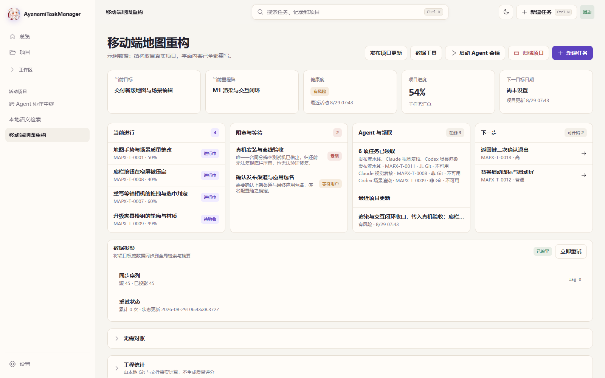
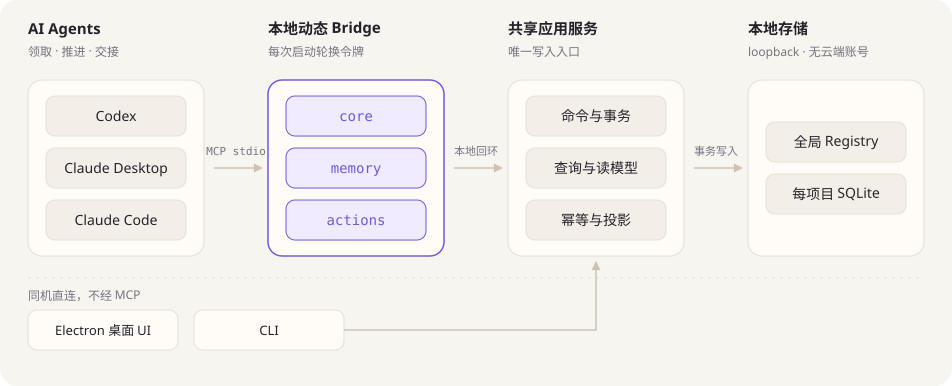
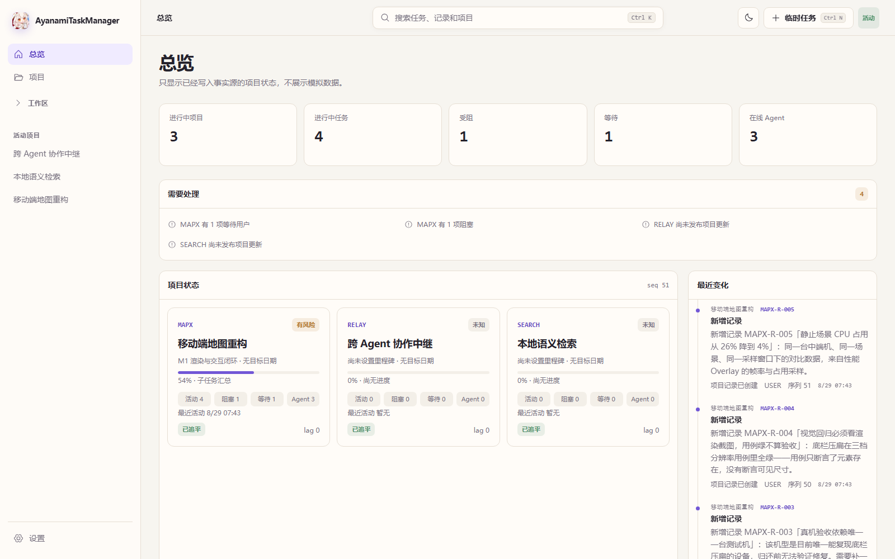

<div align="center">
  
  <h1>绫波任务管理器</h1>
  <p><strong>让 Codex、Claude 与每一次开发 Session，共享同一份可信项目事实。</strong></p>
  <p>Local-first project control plane for AI agents on Windows.</p>

  <p>
    <a href="https://github.com/ayanamislover/AyanamiTaskManager/releases/latest"></a>
    <a href="https://github.com/ayanamislover/AyanamiTaskManager/actions/workflows/ci.yml"></a>
    
    <a href="./LICENSE"></a>
  </p>

  <p>
    <a href="https://github.com/ayanamislover/AyanamiTaskManager/releases/latest"><strong>下载稳定版</strong></a>
    ·
    <a href="./docs/user-guide.md">用户指南</a>
    ·
    <a href="./docs/agent-integration.md">Agent 接入</a>
    ·
    <a href="./docs/security-model.md">安全模型</a>
    ·
    <a href="./docs/open-source-preflight.md">开源预检</a>
  </p>
</div>

<br />

<div align="center">
  <picture>
    <source media="(prefers-color-scheme: dark)" srcset="./docs/assets/screenshot-project-dark.png" />
    
  </picture>
  <p><sub>示例数据：结构取自真实项目，字面内容已全部重写。可用 <code>pnpm exec tsx scripts/render-readme-screenshot.ts</code> 复现。</sub></p>
</div>

---

Agent 写代码不难，难的是**换一次 Session 就忘了项目到哪儿了**。上下文被压缩、进程重启、换个 Agent 接手——项目历史只活在聊天记录里，于是每次开工都要重新翻一遍，翻完还未必翻对。

AyanamiTaskManager（ATM）把计划、任务、进度、阻塞、长期记录、证据和 Session 交接收进一个稳定的事实源，Agent 开工时读一份 brief 就能接着干。它不是另一份待办清单，也不保存整段对话，只保留真正会影响项目推进的结构化事实。桌面 UI、MCP、CLI 与本地 HTTP 共用同一套事务应用服务——你在界面上看到的，和 Agent 读到的，永远是同一份数据。

## 为什么需要 ATM

| 能力             | ATM 提供的结果                                                                       |
| ---------------- | ------------------------------------------------------------------------------------ |
| **一份事实源**   | 目标、里程碑、叶子 WorkItem、依赖、验收标准与证据始终一致；界面和 Agent 读同一份数据 |
| **Agent 原生**   | Codex、Claude Desktop、Claude Code 经 MCP 直接领取、推进、交接，不需要人来转述       |
| **压缩后可恢复** | brief / delta / 精确读取 + 长期 records，开工读一份摘要即可续上，不重扫历史          |
| **并发不打架**   | Session 领取、幂等 mutation、乐观并发版本号、租约过期接管、Review 状态全程可追溯     |
| **工程可见**     | 项目时间线、Session 的 Git 上下文、工程统计、在线备份恢复与发布证据同屏呈现          |
| **完全本地**     | 每项目独立 SQLite，仅监听 loopback，令牌每次启动轮换，不需要任何云端账号             |

## 实战数据

ATM 自己就是用 ATM 管的。下面是本机 SQLite 里的真实计数，截至 2026-08-29：

| 指标          | ATM 自身开发                | 本机全部 11 个受管项目 |
| ------------- | --------------------------- | ---------------------- |
| 工作项        | 300（282 完成 / 18 取消）   | 1,129（871 完成）      |
| Agent Session | 273，来自 117 个 Agent 身份 | 819                    |
| 进度更新      | 399                         | 1,304                  |
| 长期记录      | 130                         | 1,019                  |
| 事件          | 3,038                       | 11,659                 |
| 时间跨度      | 22 天（8/7 – 8/29）         | —                      |

值得看的不是总量，是**平均每个 Session 只推进约 1.1 个工作项**——273 次开工分布在 117 个不同的 Agent 身份上：Codex 系 144 次、CLI 71 次、Claude Code 30 次，其余为子 Agent 与本地工具。这正是 Agent 开发的常态：单次会话很短，换手极其频繁。同一段时间里，这些 Session 产出了 47,184 行生产代码与 45,314 行测试代码，分布在 648 个文件中。

支撑这个节奏的不是更长的上下文，是每次开工都能拿到一份可信的 brief。

## 性能与交付证据

事实源慢一点就没人用，所以性能是硬门禁，不是“以后再优化”。以下是 1.0.22 的实测值，超过门禁上限直接拒绝发布：

| 场景                    | 实测        | 门禁上限 |
| ----------------------- | ----------- | -------- |
| 冷启动到可交互          | 764 ms      | 3,000 ms |
| 100 个项目的总览        | p95 2.0 ms  | 200 ms   |
| 10,000 条任务的筛选列表 | p95 4.0 ms  | 200 ms   |
| 50,000 篇文档的中文检索 | p95 36.5 ms | 300 ms   |
| 单次写入并落事件        | p95 25.7 ms | 100 ms   |
| 增量拉取 100 条事件     | p95 2.1 ms  | 100 ms   |
| 常驻内存                | 144.9 MB    | 150 MB   |

每个版本还带一份可核对的证据包：候选先算指纹（gitHead、工作区脏状态哈希、源码哈希、lockfile 哈希、各阶段哈希），再逐层验证，每层记录产物的 SHA-256——

**SOURCE_DONE → CI_VERIFIED → PACKAGED_VERIFIED → INSTALLED_VERIFIED**

1.0.22 走完四层的实际结果：862 个单元与集成用例、20 个 Playwright e2e（0 失败、0 flaky）、packaged / portable / installed 三套 smoke 各 54 项、分发 smoke 19 项。任一层哈希对不上，流水线就停在那一层。

顺带一个能说明取向的数字：**47,184 行生产代码，对 45,314 行测试代码**，分布在 247 个测试文件里。

## 产品结构

<div align="center">
  <picture>
    <source media="(prefers-color-scheme: dark)" srcset="./docs/assets/architecture-dark.svg" />
    
  </picture>
</div>

正式桌面 daemon 每次启动都会轮换本地鉴权令牌。Agent 配置连接的是动态 bridge，而不是把 endpoint 或 token 固定写进长期配置；完整边界见[本地安全模型](./docs/security-model.md)。

## 安装

当前稳定版支持 Windows 10/11 x64。

1. 打开 [Latest Release](https://github.com/ayanamislover/AyanamiTaskManager/releases/latest)。
2. 日常使用选择 `AyanamiTaskManager-Setup-*-win-x64.exe`；需要免安装时选择 portable ZIP。
3. 启动 ATM，在“设置 → Agent 接入”中安装 Codex、Claude Desktop 或 Claude Code 配置。
4. 开启“登录启动”后，ATM 会在 Windows 登录后随机延迟后台启动；关闭窗口只会收进托盘。

应用数据默认位于 `%LOCALAPPDATA%\AyanamiTaskManager`。安装版会把精简 Agent Guide 与完整文档同步到该目录，换设备后仍能从同一路径发现使用说明。

> [!IMPORTANT]
> 不要把 `%LOCALAPPDATA%\AyanamiTaskManager\runtime\daemon.json`、Bearer token、项目数据库或备份提交到仓库。ATM 的运行时发现文件只服务当前 Windows 用户和当前 daemon 实例。

## Agent 接入

ATM 会最小合并现有配置，并在写入前创建备份：

| 客户端         | MCP 配置                                      | 规则与技能                                |
| -------------- | --------------------------------------------- | ----------------------------------------- |
| Codex          | `~/.codex/config.toml`                        | `~/.codex/AGENTS.md`、`~/.codex/skills`   |
| Claude Desktop | `%APPDATA%/Claude/claude_desktop_config.json` | `~/.claude/CLAUDE.md`、`~/.claude/skills` |
| Claude Code    | 由官方 `claude` CLI 注册                      | 与 Claude Desktop 共用                    |

最短工作流：

1. `atm_begin` 开工，并直接使用返回的 brief。
2. 按需读取 READY 叶子 WorkItem，使用 `atm_task_patch` 领取并开始。
3. 只在状态真正变化时写 progress；长期事实、决策、风险和证据写 record。
4. 验证后完成 WorkItem，Session 结束调用 `atm_end`。

只有上下文压缩、长时间离开或明确恢复 working set 时才调用 `atm_brief`。任务过大时，应先按“可交付结果 + 可验证验收”拆成独立叶子 WorkItem。完整规则和字段约定见 [Agent 接入指南](./docs/agent-integration.md) 与仓库根目录的 [ATM_AGENT_GUIDE.md](./ATM_AGENT_GUIDE.md)。

工具表拆成 `core` / `memory` / `actions` 三个 profile，不是为了分类好看：单个 profile 的工具 schema 只有 **7,680 字节**预算（8 KB 上限扣掉 512 字节保留），塞不下就注册不进去。这条预算由用例守着，加字段前先算账。

## 日常使用

<div align="center">
  <picture>
    <source media="(prefers-color-scheme: dark)" srcset="./docs/assets/screenshot-overview-dark.png" />
    
  </picture>
  <p><sub>总览把所有受管项目的进行中、受阻、等待和在线 Agent 汇到一屏。</sub></p>
</div>

桌面端提供：

- 总览、项目、任务列表/看板/时间线/层级和长期记录；
- Agent 按项目聚合、Session Git 上下文、claim 与交接；
- 临时任务晋升、保存视图、中文搜索和实时事件；
- 在线备份恢复、导入导出、工程统计与托盘通知；
- 开机随机延迟后台启动，以及关闭到托盘的常驻模式。

更完整的操作说明见[用户指南](./docs/user-guide.md)，故障定位见[排障指南](./docs/troubleshooting.md)，便携版差异见[便携版说明](./docs/portable-usage.md)。

## 本地开发

需要 Node.js `>=22.13.0` 与 pnpm `11.16.0`：

```powershell
git clone https://github.com/ayanamislover/AyanamiTaskManager.git
Set-Location AyanamiTaskManager
corepack enable
pnpm install --frozen-lockfile
pnpm dev
```

开发态 Web 界面固定监听 `http://127.0.0.1:9999`；daemon API 使用运行时发现文件声明的独立 loopback 端口。开发和测试可通过 `ATM_DATA_DIR` 指向隔离数据目录。

六道质量门禁，缺一道都不算过：

```powershell
pnpm format:check
pnpm lint
pnpm typecheck
pnpm test
pnpm build
pnpm test:e2e
```

发布流水线在这之上继续：生成并验证 Squirrel 安装版与 portable ZIP，跑 packaged / distribution smoke、性能 benchmark 和安装态验收，最后把上面那份四层证据包落盘。维护者流程见[发布检查表](./docs/release-checklist.md)。

README 里的图和截图都由脚本生成，不手工维护：

```powershell
pnpm exec tsx scripts/render-architecture-diagram.ts
pnpm exec tsx scripts/render-readme-screenshot.ts
```

## 参与贡献

欢迎提交问题、文档改进和经过验证的修复。开始前请阅读[贡献指南](./CONTRIBUTING.md)与[行为准则](./CODE_OF_CONDUCT.md)。安全问题不要公开提交 Issue，请按[安全策略](./SECURITY.md)私下报告。

## 开源许可

AyanamiTaskManager 以 [GNU Affero General Public License v3.0 only](./LICENSE) 发布。项目 logo 与视觉资产的来源说明见[视觉资产来源](./docs/asset-provenance.md)；第三方依赖继续遵循各自许可证。

<div align="center">
  <sub>Local-first · Agent-native · Built with care by Ayanami, Codex and Claude.</sub>
</div>
