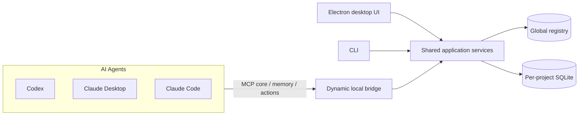

<div align="center">
  
  <h1>绫波任务管理器</h1>
  <p><strong>让 Codex、Claude 与每一次开发 Session，共享同一份可信项目事实。</strong></p>
  <p>Local-first project control plane for AI agents on Windows.</p>

  <p>
    <a href="https://github.com/ayanamislover/AyanamiTaskManager/releases/latest"></a>
    <a href="https://github.com/ayanamislover/AyanamiTaskManager/actions/workflows/ci.yml"></a>
    
    <a href="./LICENSE"></a>
  </p>

  <p>
    <a href="https://github.com/ayanamislover/AyanamiTaskManager/releases/latest"><strong>下载稳定版</strong></a>
    ·
    <a href="./docs/user-guide.md">用户指南</a>
    ·
    <a href="./docs/agent-integration.md">Agent 接入</a>
    ·
    <a href="./docs/security-model.md">安全模型</a>
    ·
    <a href="./docs/open-source-preflight.md">开源预检</a>
  </p>
</div>

---

AyanamiTaskManager（ATM）是面向本地 AI Agent 开发工作流的 Windows 项目进度控制台。它把计划、任务、进度、阻塞、长期记录、证据与 Session 交接收进一个稳定的事实源，让 Agent 在上下文压缩、重启或换手之后，不必重新翻完整聊天记录。

ATM 不是另一份待办清单，也不保存整段对话。它专注于真正会影响项目推进的结构化事实，并让桌面 UI、MCP、CLI 与本地 HTTP 共用同一套事务应用服务。

## 为什么需要 ATM

| 能力               | ATM 提供的结果                                                         |
| ------------------ | ---------------------------------------------------------------------- |
| **项目事实源**     | 目标、里程碑、叶子 WorkItem、依赖、验收标准和证据保持一致              |
| **Agent 原生接入** | Codex、Claude Desktop、Claude Code 可直接通过 MCP 领取、推进和交接任务 |
| **上下文恢复**     | brief、delta、精确读取与 durable records，避免压缩后重扫整个项目历史   |
| **协作安全**       | Session、claim、幂等 mutation、版本冲突与 Review 状态都可追溯          |
| **工程可见性**     | 项目时间线、Git 上下文、工程统计、备份恢复与发布证据统一呈现           |
| **本地优先**       | 每项目独立 SQLite；服务仅监听 loopback，不需要云端账号                 |

## 产品结构



正式桌面 daemon 每次启动都会轮换本地鉴权令牌。Agent 配置连接的是动态 bridge，而不是把 endpoint 或 token 固定写进长期配置；完整边界见[本地安全模型](./docs/security-model.md)。

## 安装

当前稳定版支持 Windows 10/11 x64。

1. 打开 [Latest Release](https://github.com/ayanamislover/AyanamiTaskManager/releases/latest)。
2. 日常使用选择 `AyanamiTaskManager-Setup-*-win-x64.exe`；需要免安装时选择 portable ZIP。
3. 启动 ATM，在“设置 → Agent 接入”中安装 Codex、Claude Desktop 或 Claude Code 配置。
4. 开启“登录启动”后，ATM 会在 Windows 登录后随机延迟后台启动；关闭窗口只会收进托盘。

应用数据默认位于 `%LOCALAPPDATA%\AyanamiTaskManager`。安装版会把精简 Agent Guide 与完整文档同步到该目录，换设备后仍能从同一路径发现使用说明。

> [!IMPORTANT]
> 不要把 `%LOCALAPPDATA%\AyanamiTaskManager\runtime\daemon.json`、Bearer token、项目数据库或备份提交到仓库。ATM 的运行时发现文件只服务当前 Windows 用户和当前 daemon 实例。

## Agent 接入

ATM 会最小合并现有配置，并在写入前创建备份：

| 客户端         | MCP 配置                                      | 规则与技能                                |
| -------------- | --------------------------------------------- | ----------------------------------------- |
| Codex          | `~/.codex/config.toml`                        | `~/.codex/AGENTS.md`、`~/.codex/skills`   |
| Claude Desktop | `%APPDATA%/Claude/claude_desktop_config.json` | `~/.claude/CLAUDE.md`、`~/.claude/skills` |
| Claude Code    | 由官方 `claude` CLI 注册                      | 与 Claude Desktop 共用                    |

最短工作流：

1. `atm_begin` 开工，并直接使用返回的 brief。
2. 按需读取 READY 叶子 WorkItem，使用 `atm_task_patch` 领取并开始。
3. 只在状态真正变化时写 progress；长期事实、决策、风险和证据写 record。
4. 验证后完成 WorkItem，Session 结束调用 `atm_end`。

只有上下文压缩、长时间离开或明确恢复 working set 时才调用 `atm_brief`。任务过大时，应先按“可交付结果 + 可验证验收”拆成独立叶子 WorkItem。完整规则和字段约定见 [Agent 接入指南](./docs/agent-integration.md) 与仓库根目录的 [ATM_AGENT_GUIDE.md](./ATM_AGENT_GUIDE.md)。

## 日常使用

桌面端提供：

- 总览、项目、任务列表/看板/时间线/层级和长期记录；
- Agent 按项目聚合、Session Git 上下文、claim 与交接；
- 临时任务晋升、保存视图、中文搜索和实时事件；
- 在线备份恢复、导入导出、工程统计与托盘通知；
- 开机随机延迟后台启动，以及关闭到托盘的常驻模式。

更完整的操作说明见[用户指南](./docs/user-guide.md)，故障定位见[排障指南](./docs/troubleshooting.md)，便携版差异见[便携版说明](./docs/portable-usage.md)。

## 本地开发

需要 Node.js `>=22.13.0` 与 pnpm `11.16.0`：

```powershell
git clone https://github.com/ayanamislover/AyanamiTaskManager.git
Set-Location AyanamiTaskManager
corepack enable
pnpm install --frozen-lockfile
pnpm dev
```

开发态 Web 界面固定监听 `http://127.0.0.1:9999`；daemon API 使用运行时发现文件声明的独立 loopback 端口。开发和测试可通过 `ATM_DATA_DIR` 指向隔离数据目录。

常用质量门禁：

```powershell
pnpm format:check
pnpm lint
pnpm typecheck
pnpm test
pnpm build
pnpm test:e2e
```

发布流水线还会生成并验证 Squirrel 安装版与 portable ZIP，执行 packaged/distribution smoke、benchmark 和安装态验收。维护者流程见[发布检查表](./docs/release-checklist.md)。

## 参与贡献

欢迎提交问题、文档改进和经过验证的修复。开始前请阅读[贡献指南](./CONTRIBUTING.md)与[行为准则](./CODE_OF_CONDUCT.md)。安全问题不要公开提交 Issue，请按[安全策略](./SECURITY.md)私下报告。

## 开源许可

AyanamiTaskManager 以 [GNU Affero General Public License v3.0 only](./LICENSE) 发布。项目 logo 与视觉资产的来源说明见[视觉资产来源](./docs/asset-provenance.md)；第三方依赖继续遵循各自许可证。

<div align="center">
  <sub>Local-first · Agent-native · Built with care by Ayanami, Codex and Claude.</sub>
</div>
